# 3 Boxes Luxury Curations — Technical & Functional Documentation

> **Version:** 2.0.0 | **Last Updated:** 2025-07-31 | **Status:** Production  
> **Platform:** 3boxes.in | **Repository:** Next.js 16 Monorepo  
> **Authors:** 3 Boxes Engineering Team

---

## Table of Contents

1. [System Architecture](#1-system-architecture)
2. [Technology Stack](#2-technology-stack)
3. [Database Schema](#3-database-schema)
4. [API Reference](#4-api-reference)
5. [Authentication & Authorization](#5-authentication--authorization)
6. [AI Integration](#6-ai-integration)
7. [Product Management](#7-product-management)
8. [Corporate Gifting](#8-corporate-gifting)
9. [Payment & Checkout](#9-payment--checkout)
10. [Third-Party Integrations](#10-third-party-integrations)
11. [Social Style Integration](#11-social-style-integration)
12. [3Box Curate / SmartBundle](#12-3box-curate--smartbundle)
13. [Family Shopping](#13-family-shopping)
14. [Real-time Features](#14-real-time-features)
15. [Security](#15-security)
16. [Performance](#16-performance)
17. [Deployment](#17-deployment)

---

## 1. System Architecture

### 1.1 High-Level Architecture Overview

The 3 Boxes Luxury Curations platform is a full-stack Next.js 16 application deployed on Vercel with a serverless architecture pattern. The system integrates with Shopify for product management, multiple external e-commerce portals for cross-portal aggregation, and AI services for virtual try-on, gift recommendations, and style analysis.

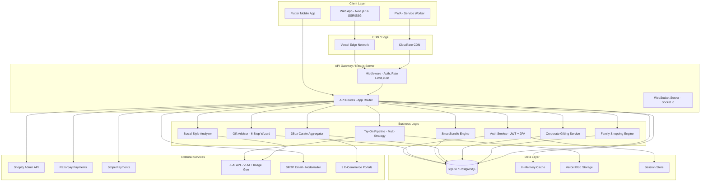
```mermaid
graph TB
    subgraph "Client Layer"
        WEB[Web App - Next.js 16 SSR/SSG]
        PWA[PWA - Service Worker]
        FLUTTER[Flutter Mobile App]
    end

    subgraph "CDN / Edge"
        VERCEL[Vercel Edge Network]
        CF[Cloudflare CDN]
    end

    subgraph "API Gateway / Next.js Server"
        API[API Routes - App Router]
        MW[Middleware - Auth, Rate Limit, i18n]
        WS[WebSocket Server - Socket.io]
    end

    subgraph "Business Logic"
        AUTH[Auth Service - JWT + 2FA]
        TRYON[Try-On Pipeline - Multi-Strategy]
        GIFT[Gift Advisor - 6-Step Wizard]
        BUNDLE[SmartBundle Engine]
        SOCIAL[Social Style Analyzer]
        FAMILY[Family Shopping Engine]
        CORP[Corporate Gifting Service]
        CURATE[3Box Curate Aggregator]
    end

    subgraph "Data Layer"
        DB[(SQLite / PostgreSQL)]
        CACHE[In-Memory Cache]
        BLOB[Vercel Blob Storage]
        SESSION[Session Store]
    end

    subgraph "External Services"
        SHOPIFY[Shopify Admin API]
        RAZOR[Razorpay Payments]
        STRIPE[Stripe Payments]
        ZAI[Z-AI API - VLM + Image Gen]
        SMTP[SMTP Email - Nodemailer]
        PORTALS[9 E-Commerce Portals]
    end

    WEB --> VERCEL
    PWA --> CF
    FLUTTER --> API

    VERCEL --> MW
    CF --> MW
    MW --> API

    API --> AUTH
    API --> TRYON
    API --> GIFT
    API --> BUNDLE
    API --> SOCIAL
    API --> FAMILY
    API --> CORP
    API --> CURATE

    AUTH --> DB
    AUTH --> SESSION
    TRYON --> ZAI
    TRYON --> BLOB
    GIFT --> DB
    BUNDLE --> DB
    SOCIAL --> ZAI
    CURATE --> PORTALS
    CURATE --> DB
    CORP --> DB
    FAMILY --> DB

    API --> SHOPIFY
    API --> RAZOR
    API --> STRIPE
    API --> SMTP
    API --> CACHE
    API --> DB
```

### 1.2 Component Hierarchy

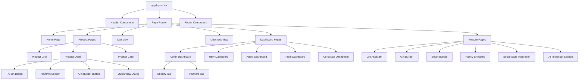
```mermaid
graph TD
    APP[app/layout.tsx] --> HEADER[Header Component]
    APP --> MAIN[Page Router]
    APP --> FOOTER[Footer Component]

    MAIN --> HOME[Home Page]
    MAIN --> PRODUCTS[Product Pages]
    MAIN --> CART[Cart View]
    MAIN --> CHECKOUT[Checkout View]
    MAIN --> DASHBOARDS[Dashboard Pages]
    MAIN --> FEATURES[Feature Pages]

    PRODUCTS --> PGRID[Product Grid]
    PRODUCTS --> PDETAIL[Product Detail]
    PRODUCTS --> PCARD[Product Card]

    PDETAIL --> TRYON_DLG[Try-On Dialog]
    PDETAIL --> REVIEWS[Reviews Section]
    PDETAIL --> GIFT_BTN[Gift Builder Button]
    PDETAIL --> QUICK[Quick View Dialog]

    DASHBOARDS --> ADMIN[Admin Dashboard]
    DASHBOARDS --> USER[User Dashboard]
    DASHBOARDS --> AGENT[Agent Dashboard]
    DASHBOARDS --> TEAM[Team Dashboard]
    DASHBOARDS --> CORPORATE[Corporate Dashboard]

    FEATURES --> GIFT_ASST[Gift Assistant]
    FEATURES --> GIFT_BLD[Gift Builder]
    FEATURES --> SMART[Smart Bundle]
    FEATURES --> FAMILY_SHOP[Family Shopping]
    FEATURES --> SOCIAL_STY[Social Style Integration]
    FEATURES --> AI_INFLU[AI Influencer Section]

    ADMIN --> SHOPIFY_TAB[Shopify Tab]
    ADMIN --> PARTNERS_TAB[Partners Tab]
```

### 1.3 Data Flow Architecture

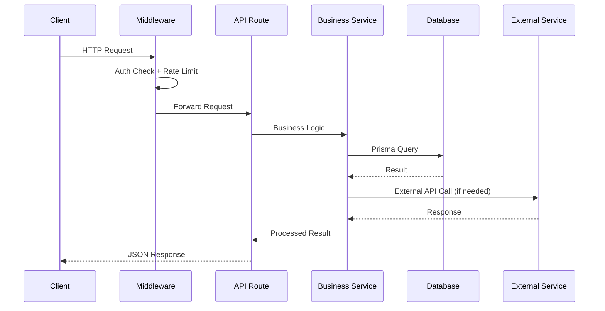
```mermaid
sequenceDiagram
    participant C as Client
    participant MW as Middleware
    participant API as API Route
    participant SVC as Business Service
    participant DB as Database
    participant EXT as External Service

    C->>MW: HTTP Request
    MW->>MW: Auth Check + Rate Limit
    MW->>API: Forward Request
    API->>SVC: Business Logic
    SVC->>DB: Prisma Query
    DB-->>SVC: Result
    SVC->>EXT: External API Call (if needed)
    EXT-->>SVC: Response
    SVC-->>API: Processed Result
    API-->>C: JSON Response
```

### 1.4 Request Lifecycle

Every API request follows this lifecycle:

1. **Client Request** — HTTP request from browser/mobile with Bearer token
2. **Middleware Processing** — CORS headers, rate limiting, geo-detection
3. **Authentication** — `verifyAuth()` extracts and validates JWT/session token
4. **Authorization** — Role/permission check against required access level
5. **Business Logic** — Service layer processes the request
6. **Database Operation** — Prisma ORM query (SQLite dev / PostgreSQL prod)
7. **Response** — JSON response with appropriate status code
8. **Audit Logging** — Significant actions logged to AuditLog table

### 1.5 Project Directory Structure

```
src/
├── app/                          # Next.js App Router
│   ├── api/                      # API Route Handlers
│   │   ├── auth/                 # Authentication endpoints
│   │   ├── admin/                # Admin-only endpoints
│   │   ├── shopify/              # Shopify integration
│   │   ├── corporate/            # Corporate gifting
│   │   ├── products/             # Product CRUD
│   │   ├── orders/               # Order management
│   │   ├── payments/             # Payment processing
│   │   ├── try-on/               # AI Try-On
│   │   ├── social/               # Social style analysis
│   │   ├── smartbundle/          # SmartBundle creation
│   │   ├── family/               # Family packages
│   │   ├── gift-recommend/       # AI Gift Advisor
│   │   ├── checkout/             # Checkout flow
│   │   ├── cart/                 # Cart operations
│   │   ├── partners/             # Platform partners
│   │   ├── integrations/         # Integration management
│   │   ├── product-import/       # Product scraping/import
│   │   ├── support/              # Support tickets
│   │   ├── wiki/                 # Wiki documentation
│   │   └── ...                   # Other endpoints
│   ├── globals.css               # Global styles
│   ├── layout.tsx                # Root layout
│   ├── page.tsx                  # Home page
│   └── error.tsx                 # Error boundary
├── components/                   # React Components
│   ├── ui/                       # shadcn/ui primitives (40+)
│   ├── admin-dashboard.tsx       # Admin panel
│   ├── product-grid.tsx          # Product listing
│   ├── product-detail.tsx        # Product detail view
│   ├── try-on-dialog.tsx         # AI Try-On UI
│   ├── gift-assistant.tsx        # Gift Advisor chat
│   ├── gift-builder.tsx          # Gift Builder wizard
│   ├── smart-bundle.tsx          # SmartBundle UI
│   ├── family-shopping.tsx       # Family packages
│   ├── social-style-integration.tsx # Social connection
│   ├── corporate-dashboard.tsx   # Corporate portal
│   ├── checkout-view.tsx         # Checkout flow
│   ├── cart-view.tsx             # Cart management
│   ├── header.tsx / footer.tsx   # Layout shell
│   ├── hero-section.tsx          # Landing hero
│   ├── category-grid.tsx         # Category browsing
│   ├── language-switcher.tsx     # i18n selector
│   ├── currency-switcher.tsx     # Currency selector
│   ├── auth-dialog.tsx           # Login/Register
│   └── ...                       # 30+ more components
├── lib/                          # Core Libraries
│   ├── auth.ts                   # JWT authentication
│   ├── db.ts                     # Prisma client
│   ├── shopify.ts                # Shopify client
│   ├── shopify/client.ts         # Storefront API
│   ├── shopify/admin-client.ts   # Admin API
│   ├── try-on-pipeline.ts        # AI Try-On engine
│   ├── zai.ts                    # Z-AI SDK wrapper
│   ├── encryption.ts             # AES-256-GCM
│   ├── rate-limiter.ts           # In-memory rate limiter
│   ├── sessions.ts               # Session management
│   ├── email.ts                  # Nodemailer config
│   ├── currency.ts               # Currency formatter
│   ├── currency/config.ts        # Currency configuration
│   ├── i18n/index.ts             # i18n utilities
│   ├── watermark.ts              # Image watermarking
│   ├── image-utils.ts            # Image processing
│   ├── image-downloader.ts       # Image fetching
│   ├── store.ts                  # Zustand store
│   ├── utils.ts                  # Utility functions
│   ├── validations/auth.ts       # Zod auth schemas
│   ├── password-validator.ts     # Password strength
│   ├── api-logger.ts             # API logging
│   ├── geo/country-map.ts        # Geo detection
│   ├── static-products.ts        # Fallback product data
│   ├── demo-otp-store.ts         # Demo OTP storage
│   └── auth-helper.ts            # Auth utilities
├── hooks/                        # Custom React Hooks
│   ├── useCurrency.ts            # Currency conversion
│   ├── useLocale.ts              # Locale detection
│   ├── useTranslation.ts         # i18n translations
│   ├── useGeoDetection.ts        # Geo-based settings
│   ├── usePWAInstall.ts          # PWA install prompt
│   ├── useAffiliateClick.ts      # Affiliate tracking
│   ├── use-mobile.ts             # Mobile detection
│   └── use-toast.ts              # Toast notifications
├── i18n/                         # Internationalization
│   ├── config.ts                 # i18n configuration
│   └── messages/                 # Locale JSON files (10)
└── instrumentation.ts            # Next.js instrumentation
```

---

## 2. Technology Stack

### 2.1 Core Framework

| Technology | Version | Purpose |
|---|---|---|
| **Next.js** | ^16.1.1 | Full-stack React framework with App Router, SSR/SSG, API routes |
| **React** | ^19.2.6 | UI library with concurrent features and Server Components |
| **React DOM** | ^19.2.6 | DOM rendering for React |
| **TypeScript** | ^5 | Static type checking |
| **Tailwind CSS** | ^4 | Utility-first CSS framework |
| **Prisma** | ^6.11.1 | ORM for database access (SQLite dev / PostgreSQL prod) |

### 2.2 UI & Component Libraries

| Library | Version | Purpose |
|---|---|---|
| **@radix-ui/react-*** | Various | 25+ Radix UI primitives for accessible components |
| **class-variance-authority** | ^0.7.1 | Component variant management (cva) |
| **clsx** | ^2.1.1 | Conditional class name builder |
| **tailwind-merge** | ^3.3.1 | Intelligent Tailwind class merging |
| **tailwindcss-animate** | ^1.0.7 | Animation utilities for Tailwind |
| **lucide-react** | ^0.525.0 | Icon library (1000+ icons) |
| **framer-motion** | ^12.23.2 | Animation library for gestures, layouts, transitions |
| **embla-carousel-react** | ^8.6.0 | Carousel/slider component |
| **cmdk** | ^1.1.1 | Command palette component |
| **vaul** | ^1.1.2 | Drawer component for mobile |
| **sonner** | ^2.0.6 | Toast notification system |
| **react-icons** | ^5.6.0 | Additional icon sets (Font Awesome, Material, etc.) |
| **recharts** | ^3.8.1 | Charting library for admin dashboards |
| **input-otp** | ^1.4.2 | OTP input component for 2FA |

### 2.3 State Management & Data Fetching

| Library | Version | Purpose |
|---|---|---|
| **zustand** | ^5.0.6 | Global state management (client-side store) |
| **@tanstack/react-query** | ^5.82.0 | Server state management, caching, background refetch |
| **@tanstack/react-table** | ^8.21.3 | Headless table component for admin data tables |
| **react-hook-form** | ^7.60.0 | Form state management with validation |
| **@hookform/resolvers** | ^5.1.1 | Zod resolver for react-hook-form |
| **zod** | ^4.0.2 | Schema validation library |

### 2.4 Authentication & Security

| Library | Version | Purpose |
|---|---|---|
| **jsonwebtoken** | ^9.0.3 | JWT token generation and verification |
| **bcryptjs** | ^3.0.3 | Password hashing (bcrypt with salt rounds 12) |
| **next-auth** | ^4.24.11 | OAuth provider integration (Google, Facebook, LinkedIn) |
| **Node.js crypto** | Built-in | AES-256-GCM encryption for sensitive fields |

### 2.5 AI & Image Processing

| Library | Version | Purpose |
|---|---|---|
| **z-ai-web-dev-sdk** | ^0.0.17 | Z-AI API client for VLM and image generation |
| **sharp** | ^0.34.5 | Server-side image processing (resize, composite, watermark) |
| **playwright** | ^1.60.0 | Browser automation for product scraping |

### 2.6 Payments & Commerce

| Library | Version | Purpose |
|---|---|---|
| **Razorpay** | API | Indian payment gateway (UPI, cards, netbanking, wallets) |
| **Stripe** | API | International payment gateway (cards, Apple Pay, Google Pay) |

### 2.7 Communication & Notifications

| Library | Version | Purpose |
|---|---|---|
| **nodemailer** | ^8.0.10 | Email sending (OTP, order confirmations, invoices) |
| **socket.io** | Server | WebSocket real-time communication |

### 2.8 Internationalization

| Library | Version | Purpose |
|---|---|---|
| **next-intl** | ^4.3.4 | Next.js i18n integration |
| **Locale files** | 10 langs | en, hi, zh, es, ja, ar, de, fr, ko, pt |

### 2.9 Development & Build Tools

| Tool | Version | Purpose |
|---|---|---|
| **Bun** | ^1.3.4 | Fast JavaScript runtime and package manager |
| **tsx** | ^4.21.0 | TypeScript execution for scripts |
| **ESLint** | ^9 | Code linting with next config |
| **PostCSS** | ^4 | CSS processing |
| **@vercel/blob** | ^2.4.0 | Vercel Blob storage for file uploads |

### 2.10 Content & Documentation

| Library | Version | Purpose |
|---|---|---|
| **@mdxeditor/editor** | ^3.39.1 | Rich text / MDX editor for wiki/docs |
| **react-markdown** | ^10.1.0 | Markdown rendering |
| **react-syntax-highlighter** | ^15.6.1 | Code syntax highlighting |
| **pptxgenjs** | ^4.0.1 | PowerPoint generation for reports |

### 2.11 Flutter Mobile App

```
flutter_app/
├── ios/                     # iOS native wrapper
│   ├── Runner/              # App delegate, scene delegate
│   └── Flutter/             # Flutter configuration
├── lib/                     # Dart source code
└── pubspec.yaml             # Dependencies
```

---

## 3. Database Schema

### 3.1 Overview

The database uses **Prisma ORM** with **SQLite** for development and **PostgreSQL** for production (auto-switched via `vercel-build` script). The schema contains **30+ models** organized into the following domains:

- **Product & Catalog** (5 models)
- **Order & Payment** (5 models)
- **User & Authentication** (4 models)
- **Corporate Gifting** (4 models)
- **Platform Integration** (2 models)
- **Content & Documentation** (3 models)
- **Support** (2 models)
- **Commerce** (5 models)
- **i18n & Currency** (2 models)


```mermaid
erDiagram
    Category ||--o{ Category : "parent/children"
    Category ||--o{ Product : "has"
    Product ||--o{ ProductVariant : "has"
    Product ||--o{ ProductImage : "has"
    Product ||--o{ CartItem : "in"
    Product ||--o{ OrderItem : "in"
    Product ||--o{ InventoryLog : "tracked"
    Product ||--o{ WishlistItem : "saved"
    Product ||--o{ Review : "reviewed"
    Product ||--o{ CustomerPortfolio : "styled"
    Product ||--o{ CampaignRecipient : "gifted"
    Product }o--o| Vendor : "supplied by"
    Cart ||--o{ CartItem : "contains"
    Order ||--o{ OrderItem : "contains"
    Order ||--o{ OrderTrackingEvent : "tracked"
    Order ||--o{ PaymentSession : "paid via"
    Order ||--o| OrderInvoice : "invoiced"
    User ||--o{ UserPermission : "has"
    User ||--o{ Session : "has"
    User ||--o{ WishlistItem : "has"
    User ||--o| CorporateAccount : "owns"
    User ||--o{ AuditLog : "logged"
    CorporateAccount ||--o{ CorporateCampaign : "runs"
    CorporateAccount ||--o| CorporateBranding : "has"
    CorporateAccount ||--o{ CorporateMember : "has"
    CorporateCampaign ||--o{ CampaignRecipient : "targets"
    PlatformIntegration ||--o{ SyncLog : "logged"
    PlatformIntegration ||--o{ PartnerCategoryMap : "mapped"
    WikiDocument ||--o{ AgentDocShare : "shared"
    WikiDocument ||--o{ TrainingShare : "shared"
    SupportTicket ||--o{ SupportTicketMessage : "contains"
    Invoice ||--o{ InvoiceItem : "contains"
    Vendor ||--o{ Invoice : "receives"
```

### 3.2 Product & Catalog Models

#### Category

| Field | Type | Description |
|---|---|---|
| `id` | String (cuid) | Primary key |
| `name` | String | Display name (e.g., "Jewelry", "Sarees") |
| `slug` | String (unique) | URL-safe identifier (e.g., "jewelry", "sarees") |
| `description` | String? | Optional category description |
| `image` | String? | Category thumbnail image URL |
| `parentId` | String? | Self-referential parent category ID |
| `parent` | Category? | Parent category relation |
| `children` | Category[] | Child categories relation |
| `order` | Int (default: 0) | Display sort order |
| `products` | Product[] | Products in this category |

**Key Features:**
- Self-referential hierarchy supports unlimited nesting depth
- Hierarchical structure: Couple → Romantic Gifts, Couple Friendly; Men → Accessories, Shirts, etc.
- `order` field controls display sequence in navigation

#### Product

| Field | Type | Description |
|---|---|---|
| `id` | String (cuid) | Primary key |
| `productNumber` | String (unique) | Human-readable product number |
| `name` | String | Product display name |
| `slug` | String (unique) | URL-safe identifier |
| `description` | String | Full product description |
| `price` | Float | Current selling price |
| `compareAtPrice` | Float? | Original/MRP price for showing discounts |
| `costPrice` | Float? | Internal cost price for margin calculation |
| `sku` | String? | Stock Keeping Unit identifier |
| `images` | String | JSON array of image URLs |
| `categoryId` | String | Foreign key to Category |
| `stock` | Int (default: 0) | Current inventory count |
| `stockStatus` | String | "in_stock", "low_stock", "out_of_stock", "preorder" |
| `reorderLevel` | Int (default: 5) | Threshold for low stock alerts |
| `rating` | Float (default: 0) | Average rating (1-5) |
| `reviewCount` | Int (default: 0) | Number of reviews |
| `featured` | Boolean (default: false) | Featured product flag |
| `tags` | String? | JSON array of tag strings |
| `occasions` | String? | JSON array: "birthday", "anniversary", "wedding", "diwali", "christmas" |
| `recipientTypes` | String? | JSON array: "him", "her", "couple", "kids", "parents", "friend", "colleague" |
| `relationships` | String? | JSON array: "spouse", "parent", "sibling", "friend", "colleague", "boss" |
| `deliveryEstimate` | String? | e.g., "3-5 business days" |
| `vendorId` | String? | FK to Vendor (nullable for direct products) |
| `sourceUrl` | String? | Original product URL on source platform |
| `platform` | String? | Source platform: "myntra", "nykaa", "amazon", "caratlane", "tanishq", "bluestone", "voylla", "flipkart" |
| `affiliateUrl` | String? | Affiliate tracking link for external products |
| `affiliateId` | String? | Affiliate network identifier |
| `commission` | Float? | Commission percentage for affiliate products |
| `externalId` | String? | Product ID on the source platform |
| `lastSyncedAt` | DateTime? | Last successful sync timestamp |
| `syncStatus` | String | "active", "paused", "error", "removed" |
| `isExternal` | Boolean (default: false) | True = product lives on another platform |

**JSON Field Structures:**

```typescript
// images field
"images": "[\"https://cdn.shopify.com/.../image1.jpg\", \"https://cdn.shopify.com/.../image2.jpg\"]"

// occasions field
"occasions": "[\"birthday\", \"anniversary\", \"wedding\"]"

// recipientTypes field
"recipientTypes": "[\"her\", \"couple\"]"

// tags field
"tags": "[\"gold\", \"necklace\", \"temple\", \"bridal\"]"
```

#### ProductVariant

| Field | Type | Description |
|---|---|---|
| `id` | String (cuid) | Primary key |
| `productId` | String | FK to Product (cascade delete) |
| `name` | String | Variant display name (e.g., "Red / Large") |
| `sku` | String? | Variant-specific SKU |
| `price` | Float | Variant price (overrides product price if > 0) |
| `compareAtPrice` | Float? | Variant compare-at price |
| `stock` | Int (default: 0) | Variant inventory count |
| `stockStatus` | String | "in_stock", "low_stock", "out_of_stock", "preorder" |
| `attributes` | String | JSON: `{"color": "Red", "size": "Large", "material": "Gold Plated"}` |
| `image` | String? | Variant-specific image URL |
| `isActive` | Boolean (default: true) | Soft-delete toggle |

#### ProductImage

| Field | Type | Description |
|---|---|---|
| `id` | String (cuid) | Primary key |
| `productId` | String | FK to Product (cascade delete) |
| `url` | String | Image URL |
| `alt` | String? | Alt text for accessibility |
| `sort` | Int (default: 0) | Display order |
| `isActive` | Boolean (default: true) | Visibility toggle |

### 3.3 Cart & Order Models

#### Cart

| Field | Type | Description |
|---|---|---|
| `id` | String (cuid) | Primary key |
| `sessionId` | String (unique) | Session identifier for guest carts |
| `userId` | String? | Authenticated user ID |
| `couponCode` | String? | Applied coupon code |
| `items` | CartItem[] | Cart items relation |

#### CartItem

| Field | Type | Description |
|---|---|---|
| `id` | String (cuid) | Primary key |
| `cartId` | String | FK to Cart (cascade delete) |
| `productId` | String | FK to Product |
| `quantity` | Int (default: 1) | Item quantity |
| `variantId` | String? | Selected product variant |
| `giftWrapping` | Boolean (default: false) | Gift wrap request |
| `greetingMessage` | String? | Custom greeting card text |
| `hidePrice` | Boolean (default: false) | Hide price on gift packaging |

#### Order

| Field | Type | Description |
|---|---|---|
| `id` | String (cuid) | Primary key |
| `orderNumber` | String (unique) | Human-readable order number |
| `email` | String | Customer email |
| `firstName` / `lastName` | String | Customer name |
| `address` / `city` / `state` / `zipCode` / `country` | String | Shipping address |
| `phone` | String? | Contact phone |
| `subtotal` / `shipping` / `tax` / `discount` / `total` | Float | Order amounts |
| `status` | String | "pending", "processing", "shipped", "delivered", "cancelled" |
| `paymentMethod` | String | "card", "upi", "netbanking", "wallet" |
| `paymentStatus` | String | "pending", "paid", "failed", "refunded" |
| `deliveryType` | String | "standard", "express", "same-day", "scheduled" |
| `scheduledDate` | DateTime? | For scheduled deliveries |
| `occasion` | String? | Gift occasion tag |
| `giftWrapping` | Boolean | Gift wrap flag |
| `giftWrapStyle` | String? | "classic", "premium", "luxury" |
| `greetingMessage` | String? | Custom card message |
| `hidePrice` | Boolean | Hide price on package |
| `couponCode` | String? | Applied coupon |
| `trackingNumber` / `trackingUrl` | String? | Shipment tracking |
| `estimatedDelivery` | DateTime? | Expected delivery date |
| `cancelledAt` / `cancelReason` | String? | Cancellation details |
| `refundStatus` / `refundAmount` / `refundedAt` | String? | Refund tracking |

#### OrderItem

| Field | Type | Description |
|---|---|---|
| `id` | String (cuid) | Primary key |
| `orderId` | String | FK to Order (cascade delete) |
| `productId` | String | FK to Product |
| `name` | String | Product name snapshot |
| `price` | Float | Price at time of order |
| `quantity` | Int | Quantity ordered |
| `image` | String? | Product image snapshot |
| `variantId` / `variantName` | String? | Selected variant |
| `giftWrapping` | Boolean | Per-item gift wrap |
| `greetingMessage` | String? | Per-item greeting |
| `hidePrice` | Boolean | Per-item price hide |

#### OrderTrackingEvent

| Field | Type | Description |
|---|---|---|
| `id` | String (cuid) | Primary key |
| `orderId` | String | FK to Order (cascade delete) |
| `status` | String | "pending", "confirmed", "processing", "shipped", "out_for_delivery", "delivered", "cancelled" |
| `description` | String? | e.g., "Package picked up from warehouse" |
| `location` | String? | e.g., "Mumbai Hub" |
| `timestamp` | DateTime | Event time |

#### PaymentSession

| Field | Type | Description |
|---|---|---|
| `id` | String (cuid) | Primary key |
| `orderId` | String | FK to Order (cascade delete) |
| `provider` | String | "razorpay" or "stripe" |
| `providerSessionId` | String? | Razorpay order ID or Stripe session ID |
| `amount` | Float | Payment amount |
| `currency` | String (default: "INR") | ISO 4217 currency code |
| `status` | String | "created", "attempted", "paid", "failed", "expired" |
| `paymentId` | String? | Provider payment ID after success |
| `method` | String? | "card", "upi", "netbanking", "wallet" |
| `metadata` | String? | JSON: additional provider-specific data |

#### OrderInvoice

| Field | Type | Description |
|---|---|---|
| `id` | String (cuid) | Primary key |
| `orderId` | String (unique) | FK to Order |
| `invoiceNumber` | String (unique) | Invoice reference number |
| `amount` / `tax` / `total` | Float | Invoice amounts |
| `status` | String | "generated", "sent", "paid" |
| `pdfUrl` | String? | Generated PDF URL |

### 3.4 User & Authentication Models

#### User

| Field | Type | Description |
|---|---|---|
| `id` | String (cuid) | Primary key |
| `email` | String (unique) | User email address |
| `name` | String | Display name |
| `password` | String? | Bcrypt-hashed password (null for social login) |
| `role` | String (default: "user") | "admin", "user", "agent", "team", "corporate" |
| `adminRole` | String? | "super_admin", "product_manager", "order_manager", "inventory_manager", "finance_manager", "support_agent", "corporate_account_manager" |
| `corporateRole` | String? | "corporate_admin", "finance_user", "campaign_manager" |
| `avatar` | String? | Profile picture URL |
| `phone` | String? | Phone number (AES-256-GCM encrypted) |
| `isActive` | Boolean | Account active flag |
| `emailVerified` | Boolean | Email verification status |
| `phoneVerified` | Boolean | Phone verification status |
| `twoFactorSecret` | String? | TOTP secret for authenticator apps |
| `twoFactorEnabled` | Boolean | 2FA enabled flag |
| `twoFactorRequired` | Boolean | Admin-enforced 2FA requirement |
| `approvalStatus` | String | "pending", "approved", "rejected", "suspended" |
| `socialProvider` | String? | "google", "facebook", "linkedin" |
| `socialId` | String? | Provider-specific user ID |
| `resetToken` / `resetTokenExpiry` | String? / DateTime? | Password reset token |
| `otpCode` / `otpExpiry` | String? / DateTime? | Phone OTP for login/forgot password |
| `emailVerifyToken` / `emailVerifyExpiry` | String? / DateTime? | Email verification token |
| `phoneVerifyCode` / `phoneVerifyExpiry` | String? / DateTime? | Phone verification code |
| `lastLoginAt` / `lastLoginIp` / `lastLoginDevice` | DateTime? / String? | Login tracking |
| `preferredLanguage` | String? (default: "en") | ISO 639-1 language code |
| `preferredCurrency` | String? (default: "INR") | ISO 4217 currency code |
| `detectedCountry` | String? | Auto-detected country code |

#### UserPermission

| Field | Type | Description |
|---|---|---|
| `id` | String (cuid) | Primary key |
| `userId` | String | FK to User (cascade delete) |
| `permission` | String | Permission string (e.g., "products.manage", "orders.manage") |

**Unique constraint:** `[@@unique([userId, permission])]`

**Permission Strings:**

| Permission | Description |
|---|---|
| `products.manage` | Create, edit, delete products |
| `products.view` | View product details |
| `orders.manage` | Process, cancel, refund orders |
| `orders.view` | View order details |
| `accounting.view` | View financial reports |
| `accounting.manage` | Manage invoices and entries |
| `inventory.manage` | Update stock levels |
| `users.manage` | Manage user accounts |
| `corporate.manage` | Manage corporate accounts |
| `campaigns.manage` | Manage corporate campaigns |
| `reports.view` | View analytics reports |
| `settings.manage` | Manage system settings |

#### Session

| Field | Type | Description |
|---|---|---|
| `id` | String (cuid) | Primary key |
| `token` | String (unique) | Session token (JWT or random) |
| `userId` | String | FK to User (cascade delete) |
| `ipAddress` | String? | Client IP at login |
| `userAgent` | String? | Browser user agent |
| `deviceInfo` | String? | Parsed device information |
| `createdAt` | DateTime | Session creation time |
| `expiresAt` | DateTime | Session expiration time |
| `lastActivity` | DateTime | Last API call timestamp |

#### AuditLog

| Field | Type | Description |
|---|---|---|
| `id` | String (cuid) | Primary key |
| `userId` | String? | FK to User (set null on delete) |
| `action` | String | "login", "logout", "password_change", "role_change", "approval_change", "mfa_setup" |
| `entity` | String? | "user", "order", "product", "corporate", "campaign" |
| `entityId` | String? | ID of affected entity |
| `details` | String? | JSON: additional context |
| `ipAddress` | String? | Client IP |
| `userAgent` | String? | Client browser |
| `createdAt` | DateTime | Log timestamp |

### 3.5 Corporate Gifting Models

#### CorporateAccount

| Field | Type | Description |
|---|---|---|
| `id` | String (cuid) | Primary key |
| `companyName` | String | Legal company name |
| `slug` | String (unique) | URL-safe identifier |
| `industry` / `website` | String? | Business details |
| `gstNumber` / `panNumber` | String? | Tax identifiers (encrypted) |
| `billingAddress` / `billingCity` / `billingState` / `billingZipCode` / `billingCountry` | String? | Billing address |
| `contactName` / `contactEmail` / `contactPhone` | String | Primary contact |
| `address` / `city` / `state` / `zipCode` / `country` | String? | Shipping address |
| `logo` | String? | Company logo URL |
| `userId` | String (unique) | FK to User (one-to-one) |
| `approvalStatus` | String | "pending", "approved", "rejected", "suspended" |
| `creditLimit` / `creditUsed` | Float | Credit tracking |
| `discountPercent` | Float | Default corporate discount |
| `campaigns` | CorporateCampaign[] | Campaign relations |
| `branding` | CorporateBranding? | Branding relation |
| `members` | CorporateMember[] | Team members |

#### CorporateMember

| Field | Type | Description |
|---|---|---|
| `id` | String (cuid) | Primary key |
| `corporateId` | String | FK to CorporateAccount (cascade delete) |
| `userId` | String? | FK to User (nullable until invite accepted) |
| `email` | String | Invitation email |
| `name` | String? | Member name |
| `role` | String | "corporate_admin", "finance_user", "campaign_manager" |
| `status` | String | "pending", "active", "suspended" |
| `invitedAt` / `joinedAt` | DateTime | Invitation timestamps |

**Unique constraint:** `[@@unique([corporateId, email])]`

#### CorporateBranding

| Field | Type | Description |
|---|---|---|
| `id` | String (cuid) | Primary key |
| `corporateId` | String (unique) | FK to CorporateAccount (cascade delete) |
| `logoUrl` | String? | Custom logo for packaging |
| `primaryColor` / `secondaryColor` | String? | Hex color codes |
| `customMessage` | String? | Default greeting message |
| `packagingType` | String (default: "standard") | "standard", "premium", "luxury" |
| `giftWrapStyle` | String? | Ribbon color, wrapping style |
| `includeBranding` | Boolean (default: true) | Show corporate branding on package |
| `hidePrice` | Boolean (default: true) | Hide price on gift |
| `cardTemplate` | String? | Custom card template |

#### CorporateCampaign

| Field | Type | Description |
|---|---|---|
| `id` | String (cuid) | Primary key |
| `corporateId` | String | FK to CorporateAccount |
| `name` | String | Campaign name |
| `occasion` | String? | "diwali", "christmas", "new_year", "birthday", "anniversary", "onboarding" |
| `budgetPerRecipient` / `totalBudget` | Float? | Budget constraints |
| `status` | String | "draft", "pending_approval", "approved", "in_progress", "completed", "cancelled" |
| `deliveryType` | String (default: "bulk") | "bulk", "individual" |
| `deliveryDate` | DateTime? | Target delivery date |
| `message` | String? | Custom greeting message |
| `productId` | String? | Default product for all recipients |
| `recipients` | CampaignRecipient[] | Recipient list |

#### CampaignRecipient

| Field | Type | Description |
|---|---|---|
| `id` | String (cuid) | Primary key |
| `campaignId` | String | FK to CorporateCampaign (cascade delete) |
| `name` / `email` / `phone` | String | Recipient contact info |
| `designation` / `department` | String? | Professional details |
| `address` / `city` / `state` / `zipCode` | String? | Shipping address |
| `productId` | String? | Override campaign product |
| `budget` | Float? | Override campaign budget |
| `message` | String? | Override campaign message |
| `giftStatus` | String | "pending", "ordered", "shipped", "delivered", "cancelled" |
| `orderId` | String? | Linked order once placed |

### 3.6 Platform Integration Models

#### PlatformIntegration

| Field | Type | Description |
|---|---|---|
| `id` | String (cuid) | Primary key |
| `name` | String (unique) | e.g., "Myntra", "Nykaa", "CaratLane" |
| `slug` | String (unique) | e.g., "myntra", "nykaa", "caratlane" |
| `baseUrl` | String | e.g., "https://www.myntra.com" |
| `logo` | String? | Platform logo URL |
| `isActive` | Boolean | Integration toggle |
| `autoSync` | Boolean | Automatic sync toggle |
| `syncInterval` | Int (default: 3600) | Sync interval in seconds |
| `lastSyncedAt` | DateTime? | Last successful sync |
| `syncStatus` | String | "idle", "syncing", "error" |
| `lastSyncError` | String? | Error message |
| `categories` | String (default: "[]") | JSON: categories to import |
| `affiliateTag` | String? | Affiliate tracking tag |
| `commission` | Float? | Default commission percentage |
| `maxProducts` | Int (default: 500) | Maximum products to keep |
| `productCount` | Int (default: 0) | Current product count |

#### SyncLog

| Field | Type | Description |
|---|---|---|
| `id` | String (cuid) | Primary key |
| `integrationId` | String | FK to PlatformIntegration (cascade delete) |
| `type` | String | "full", "incremental", "category" |
| `status` | String | "started", "completed", "failed" |
| `productsFound` / `productsAdded` / `productsUpdated` / `productsRemoved` | Int | Sync statistics |
| `error` | String? | Error message if failed |
| `startedAt` / `completedAt` | DateTime | Sync timing |

#### PartnerCategoryMap

| Field | Type | Description |
|---|---|---|
| `id` | String (cuid) | Primary key |
| `integrationId` | String | FK to PlatformIntegration (cascade delete) |
| `partnerCatName` / `partnerCatSlug` | String | Category on partner site |
| `localCatId` | String? | Map to local category (null = create new) |

**Unique constraint:** `[@@unique([integrationId, partnerCatSlug])]`

### 3.7 Content & Documentation Models

#### WikiDocument

| Field | Type | Description |
|---|---|---|
| `id` | String (cuid) | Primary key |
| `title` / `slug` | String | Document title and URL slug (unique) |
| `content` | String | Document body (markdown/MDX) |
| `category` | String? | "architecture", "api", "technical", "general", "sop", "workflow", "patent", "training" |
| `version` | String (default: "1.0") | Document version |
| `isPublished` | Boolean | Publication status |
| `accessRoles` | String | Comma-separated: "admin,team,agent,user,corporate" |
| `docType` | String | "wiki", "sop", "workflow", "patent", "training", "video" |

#### AgentDocShare / TrainingShare

Document sharing models for agents and training with permission controls (canDownload, canShare, canView).

### 3.8 Commerce & Support Models

#### Offer

| Field | Type | Description |
|---|---|---|
| `id` | String (cuid) | Primary key |
| `title` / `description` | String | Offer details |
| `code` | String (unique) | Coupon code |
| `type` | String | "percentage" or "fixed" |
| `value` | Float | Discount amount/percentage |
| `minOrder` / `maxDiscount` | Float? | Constraints |
| `validFrom` / `validTo` | DateTime | Validity period |
| `usageLimit` / `usedCount` | Int? / Int | Usage tracking |

#### Coupon (similar to Offer with additional features)

| Field | Type | Description |
|---|---|---|
| `code` | String (unique) | Coupon code |
| `type` | String (default: "percentage") | "percentage", "fixed", "free_shipping" |

#### Vendor, Invoice, InvoiceItem

Vendor management with invoicing. Vendors supply products and receive invoices with line items.

#### AccountEntry

Double-entry accounting: type (debit/credit), category (sales, purchase, expense, refund, tax, other).

#### AffiliateClick

Tracks outbound clicks to external platforms with IP, user agent, referral code, and timestamp.

### 3.9 i18n & Currency Models

#### CurrencyRate

| Field | Type | Description |
|---|---|---|
| `code` | String (unique) | ISO 4217 (e.g., "USD", "EUR", "INR") |
| `name` | String | Full name (e.g., "US Dollar") |
| `symbol` | String | Display symbol (e.g., "$", "€", "₹") |
| `rate` | Float | Exchange rate relative to INR base |

#### GeoCountry

| Field | Type | Description |
|---|---|---|
| `code` | String (unique) | ISO 3166-1 alpha-2 (e.g., "US", "IN") |
| `name` | String | Country name |
| `currencyCode` | String | ISO 4217 currency code |
| `languageCode` | String (default: "en") | ISO 639-1 language code |
| `flagEmoji` | String? | Country flag emoji |

### 3.10 Customer Portfolio

#### CustomerPortfolio

AI-generated style previews for customers who used the Virtual Try-On feature. Stores the generated image, original selfie (only with consent), review data, and admin approval status for public display.

Key privacy fields:
- `consentGiven` — Whether customer consented to public display
- `isApproved` — Admin approval for public display
- `originalSelfie` — Stored only with explicit consent (optional)

---

## 4. API Reference

### 4.1 Authentication Endpoints

#### POST `/api/auth/register`

Register a new user account.

**Request:**
```json
{
  "name": "John Doe",
  "email": "john@example.com",
  "password": "SecureP@ss123",
  "phone": "+919876543210"
}
```

**Response (201):**
```json
{
  "user": { "id": "clx...", "email": "john@example.com", "name": "John Doe", "role": "user", "approvalStatus": "pending" },
  "token": "eyJhbGciOiJIUzI1NiIs..."
}
```

**Error Codes:**
| Code | Description |
|---|---|
| 400 | Validation error (invalid email, weak password) |
| 409 | Email already registered |
| 429 | Rate limit exceeded (3/hour) |

**Rate Limit:** 3 requests per hour per IP

---

#### POST `/api/auth/login`

Authenticate with email and password.

**Request:**
```json
{
  "email": "john@example.com",
  "password": "SecureP@ss123"
}
```

**Response (200):**
```json
{
  "user": { "id": "clx...", "email": "john@example.com", "role": "user", "twoFactorEnabled": false },
  "token": "eyJhbGciOiJIUzI1NiIs...",
  "requires2FA": false
}
```

**2FA Response (200):**
```json
{
  "requires2FA": true,
  "tempToken": "temp_clx...",
  "methods": ["totp", "email-otp"]
}
```

**Rate Limit:** 5 requests per 15 minutes per IP

---

#### POST `/api/auth/2fa/verify`

Verify 2FA code (TOTP or email OTP).

**Request:**
```json
{
  "tempToken": "temp_clx...",
  "code": "123456",
  "method": "totp"
}
```

**Response (200):**
```json
{
  "token": "eyJhbGciOiJIUzI1NiIs...",
  "user": { "id": "clx...", "email": "john@example.com", "role": "user" }
}
```

**Rate Limit:** 5 requests per 5 minutes per IP

---

#### POST `/api/auth/2fa/setup`

Set up TOTP 2FA for the authenticated user.

**Auth:** Required (Bearer token)

**Response (200):**
```json
{
  "secret": "JBSWY3DPEHPK3PXP",
  "qrCodeUrl": "otpauth://totp/3boxes:john@example.com?secret=JBSWY3DPEHPK3PXP&issuer=3boxes",
  "backupCodes": ["12345678", "23456789", "34567890", "45678901", "56789012", "67890123"]
}
```

---

#### POST `/api/auth/2fa/email-otp`

Send email OTP for 2FA verification.

**Auth:** Required (Bearer token)

**Response (200):**
```json
{ "message": "OTP sent to your email", "expiresIn": 300 }
```

---

#### POST `/api/auth/otp/send`

Send OTP to phone number for OTP-based login.

**Request:**
```json
{ "phone": "+919876543210" }
```

---

#### POST `/api/auth/otp/verify`

Verify OTP code.

**Request:**
```json
{ "phone": "+919876543210", "code": "123456" }
```

---

#### POST `/api/auth/otp-login`

Login using OTP (alternative to password).

**Request:**
```json
{ "phone": "+919876543210", "code": "123456" }
```

**Rate Limit:** 3 requests per 5 minutes per IP

---

#### POST `/api/auth/forgot-password`

Request a password reset link.

**Request:**
```json
{ "email": "john@example.com" }
```

**Rate Limit:** 3 requests per 15 minutes per IP

---

#### POST `/api/auth/reset-password`

Reset password using the reset token.

**Request:**
```json
{ "token": "reset_clx...", "password": "NewSecureP@ss456" }
```

---

#### POST `/api/auth/verify-email`

Verify email address using the verification token.

**Request:**
```json
{ "token": "verify_clx..." }
```

---

#### POST `/api/auth/verify-phone`

Verify phone number using the verification code.

**Request:**
```json
{ "phone": "+919876543210", "code": "123456" }
```

---

#### POST `/api/auth/social`

OAuth social login (Google, Facebook, LinkedIn).

**Request:**
```json
{ "provider": "google", "accessToken": "ya29.a0AfH6..." }
```

---

#### GET `/api/auth/me`

Get current authenticated user profile.

**Auth:** Required

**Response (200):**
```json
{
  "id": "clx...",
  "email": "john@example.com",
  "name": "John Doe",
  "role": "user",
  "avatar": "https://...",
  "phone": "+919876543210",
  "emailVerified": true,
  "phoneVerified": true,
  "twoFactorEnabled": false,
  "preferredLanguage": "en",
  "preferredCurrency": "INR"
}
```

---

#### POST `/api/auth/refresh`

Refresh an expiring JWT token.

**Auth:** Required

**Response (200):**
```json
{ "token": "eyJhbGciOiJIUzI1NiIs...", "expiresAt": "2025-08-01T00:00:00Z" }
```

---

#### POST `/api/auth/logout`

Invalidate the current session.

**Auth:** Required

---

#### GET `/api/auth/session`

Get current session details.

**Auth:** Required

---

#### GET `/api/auth/users`

List users (admin only).

**Auth:** Required (admin role)

**Query Parameters:**
| Param | Type | Description |
|---|---|---|
| `page` | number | Page number (default: 1) |
| `limit` | number | Items per page (default: 20) |
| `role` | string | Filter by role |
| `search` | string | Search by name/email |
| `status` | string | Filter by approval status |

---

#### POST `/api/auth/approve`

Approve or reject a user account.

**Auth:** Required (admin role)

**Request:**
```json
{ "userId": "clx...", "action": "approve", "role": "agent" }
```

### 4.2 Product Endpoints

#### GET `/api/products`

List products with filtering and pagination.

**Query Parameters:**
| Param | Type | Description |
|---|---|---|
| `page` | number | Page number (default: 1) |
| `limit` | number | Items per page (default: 20) |
| `category` | string | Filter by category slug |
| `search` | string | Search by name/description |
| `minPrice` / `maxPrice` | number | Price range filter |
| `occasion` | string | Filter by occasion |
| `recipientType` | string | Filter by recipient type |
| `platform` | string | Filter by source platform |
| `isExternal` | boolean | Filter external products |
| `sort` | string | "price_asc", "price_desc", "newest", "rating" |
| `featured` | boolean | Featured products only |

**Response (200):**
```json
{
  "products": [{ "id": "clx...", "name": "...", "price": 2999, ... }],
  "total": 150,
  "page": 1,
  "limit": 20,
  "totalPages": 8
}
```

---

#### GET `/api/products/[id]`

Get a single product by ID with full details including variants, images, and reviews.

---

#### GET `/api/products/fix-images`

Admin endpoint to fix broken product images by re-syncing from source.

**Auth:** Required (admin role)

---

#### GET `/api/categories`

List all categories with hierarchy and product counts.

---

#### GET `/api/search`

Full-text search across products, categories, and wiki documents.

**Query Parameters:**
| Param | Type | Description |
|---|---|---|
| `q` | string | Search query |
| `type` | string | "products", "categories", "all" |
| `limit` | number | Max results (default: 20) |

### 4.3 Cart & Checkout Endpoints

#### GET `/api/cart`

Get current cart with items, totals, and applied discounts.

**Auth:** Optional (guest cart via session)

---

#### POST `/api/cart`

Add item to cart or update quantity.

**Request:**
```json
{
  "productId": "clx...",
  "quantity": 1,
  "variantId": "clx...",
  "giftWrapping": true,
  "greetingMessage": "Happy Birthday!",
  "hidePrice": false
}
```

---

#### DELETE `/api/cart`

Remove item from cart.

**Request:**
```json
{ "itemId": "clx..." }
```

---

#### POST `/api/checkout`

Create an order from the current cart.

**Request:**
```json
{
  "email": "john@example.com",
  "firstName": "John",
  "lastName": "Doe",
  "address": "123 Main St",
  "city": "Mumbai",
  "state": "Maharashtra",
  "zipCode": "400001",
  "country": "India",
  "phone": "+919876543210",
  "deliveryType": "standard",
  "paymentMethod": "card",
  "couponCode": "SAVE10",
  "occasion": "birthday",
  "giftWrapping": true,
  "giftWrapStyle": "premium",
  "greetingMessage": "Happy Birthday!"
}
```

---

#### POST `/api/checkout/estimate`

Estimate shipping, tax, and total before checkout.

**Request:**
```json
{
  "items": [{ "productId": "clx...", "quantity": 2 }],
  "address": { "country": "India", "state": "Maharashtra", "zipCode": "400001" },
  "couponCode": "SAVE10"
}
```

### 4.4 Order Endpoints

#### GET `/api/orders`

List orders for the authenticated user (or all orders for admin).

**Auth:** Required

---

#### GET `/api/orders/[id]`

Get order details with items, tracking events, and payment sessions.

**Auth:** Required (own order or admin)

---

#### GET `/api/orders/[id]/invoice`

Download order invoice as PDF.

**Auth:** Required (own order or admin)

---

#### GET `/api/orders/[id]/tracking`

Get order tracking events.

**Auth:** Required

---

#### POST `/api/orders/[id]/refund`

Initiate a refund for an order.

**Auth:** Required (admin or own order)

**Request:**
```json
{ "reason": "Item damaged", "amount": 2999 }
}
```

### 4.5 Payment Endpoints

#### POST `/api/payments/create-session`

Create a payment session with Razorpay or Stripe.

**Request:**
```json
{
  "orderId": "clx...",
  "provider": "razorpay",
  "currency": "INR"
}
```

**Response (200):**
```json
{
  "sessionId": "order_OxYz123...",
  "amount": 299900,
  "currency": "INR",
  "key": "rzp_test_...",
  "provider": "razorpay"
}
```

---

#### POST `/api/payments/verify`

Verify payment completion.

**Request:**
```json
{
  "orderId": "clx...",
  "paymentId": "pay_OxYz123...",
  "signature": "abc123...",
  "provider": "razorpay"
}
```

---

#### GET `/api/payment-methods`

List available payment methods for the current user.

### 4.6 AI & Try-On Endpoints

#### POST `/api/try-on`

Start an AI virtual try-on session.

**Auth:** Required

**Request:** `multipart/form-data`
```
selfie: <image file>
productId: "clx..."
```

**Response (200):**
```json
{
  "jobId": "job_clx...",
  "status": "processing",
  "estimatedTime": 30
}
```

---

#### GET `/api/try-on/status?jobId=job_clx...`

Poll try-on job status.

**Response (200):**
```json
{
  "status": "completed",
  "imageUrl": "data:image/png;base64,...",
  "colorAccuracy": 8,
  "faceAccuracy": 9,
  "strategy": "dual-image-edit",
  "totalPasses": 2,
  "suggestions": [{ "id": "clx...", "name": "...", "price": 1999 }]
}
```

---

#### POST `/api/try-on/remote`

Try-on using remote image URLs instead of upload.

**Request:**
```json
{
  "selfieUrl": "https://...",
  "productId": "clx..."
}
```

---

#### POST `/api/ai-proxy`

Proxy endpoint for AI operations with rate limiting.

**Auth:** Required

---

#### POST `/api/gift-recommend`

Get AI-powered gift recommendations.

**Request:**
```json
{
  "recipientType": "her",
  "occasion": "birthday",
  "relationship": "spouse",
  "budget": 5000,
  "interests": ["jewelry", "fashion"],
  "age": 30
}
```

**Response (200):**
```json
{
  "recommendations": [
    { "productId": "clx...", "score": 0.95, "reason": "Perfect birthday gift for..." }
  ]
}
```

---

#### POST `/api/social/analyze`

Analyze social media style for personalized recommendations.

**Auth:** Required

**Request:**
```json
{
  "platform": "instagram",
  "accessToken": "IGQVJ...",
  "consentGiven": true
}
```

---

#### POST `/api/moderate-image`

AI-based image moderation for user uploads.

**Auth:** Required (admin or agent)

### 4.7 SmartBundle & Curate Endpoints

#### POST `/api/smartbundle/create`

Create a SmartBundle from multiple products.

**Request:**
```json
{
  "productIds": ["clx1...", "clx2...", "clx3..."],
  "name": "Diwali Gift Box",
  "occasion": "diwali",
  "recipientType": "couple",
  "budget": 10000,
  "useAI": true
}
```

---

#### GET `/api/combo-suggestions`

Get AI-powered product combination suggestions.

**Query Parameters:**
| Param | Type | Description |
|---|---|---|
| `productId` | string | Base product ID |
| `occasion` | string | Target occasion |
| `budget` | number | Total budget |

### 4.8 Corporate Gifting Endpoints

#### POST `/api/corporate/register`

Register a new corporate account.

**Request:**
```json
{
  "companyName": "Acme Corp",
  "industry": "Technology",
  "gstNumber": "27AABCU9603R1ZM",
  "contactName": "Jane Smith",
  "contactEmail": "jane@acme.com",
  "contactPhone": "+919876543210",
  "billingAddress": "..."
}
```

---

#### POST `/api/corporate/login`

Corporate-specific login with company context.

---

#### GET `/api/corporate/profile`

Get corporate account profile with branding and members.

**Auth:** Required (corporate role)

---

#### PUT `/api/corporate/branding`

Update corporate branding settings.

**Auth:** Required (corporate_admin role)

---

#### GET `/api/corporate/campaigns`

List corporate campaigns.

**Auth:** Required (corporate role)

---

#### POST `/api/corporate/campaigns`

Create a new campaign.

**Request:**
```json
{
  "name": "Diwali 2025",
  "occasion": "diwali",
  "budgetPerRecipient": 3000,
  "totalBudget": 300000,
  "deliveryDate": "2025-10-15",
  "productId": "clx...",
  "message": "Happy Diwali from Acme Corp!"
}
```

---

#### GET/PUT `/api/corporate/campaigns/[id]`

Get or update a campaign.

---

#### POST `/api/corporate/campaigns/[id]/submit`

Submit a campaign for approval.

---

#### GET/POST `/api/corporate/campaigns/[id]/recipients`

List or add campaign recipients.

---

#### PUT/DELETE `/api/corporate/campaigns/[id]/recipients/[recipientId]`

Update or remove a campaign recipient.

---

#### GET/POST `/api/corporate/members`

List or invite corporate team members.

---

#### PUT/DELETE `/api/corporate/members/[memberId]`

Update or remove a team member.

---

#### GET/POST `/api/corporate/recipients`

List or add corporate-wide recipients.

---

#### POST `/api/corporate/recipients/import-csv`

Bulk import recipients from CSV file.

**Request:** `multipart/form-data`
```
file: <csv file with columns: name, email, phone, designation, department, address>
```

### 4.9 Family Shopping Endpoints

#### GET `/api/family/packages`

Get family shopping packages filtered by occasion.

**Query Parameters:**
| Param | Type | Description |
|---|---|---|
| `occasion` | string | "diwali", "christmas", "wedding", "birthday", "raksha-bandhan" |
| `familySize` | number | Number of family members |
| `budget` | number | Total budget |

**Response (200):**
```json
{
  "packages": [
    {
      "id": "pkg_diwali_family_4",
      "name": "Diwali Family Celebration Box",
      "occasion": "diwali",
      "members": 4,
      "products": [{ "role": "father", "productId": "clx..." }, ...],
      "totalPrice": 15000,
      "discount": 15
    }
  ]
}
```

### 4.10 Platform Integration Endpoints

#### GET `/api/integrations`

List all platform integrations with status.

---

#### GET `/api/integrations/[id]`

Get integration details.

---

#### POST `/api/integrations/sync`

Trigger manual sync for an integration.

---

#### GET `/api/integrations/discover`

Discover available integrations.

---

#### GET/POST `/api/partners`

List or add platform partners.

---

#### GET/PUT `/api/partners/[id]`

Get or update a partner.

---

#### POST `/api/partners/[id]/sync`

Trigger partner product sync.

---

#### GET/POST `/api/partners/[id]/category-maps`

Get or create category mappings for a partner.

### 4.11 Product Import Endpoints

#### POST `/api/product-import/search`

Search for products on external platforms.

**Request:**
```json
{ "platform": "myntra", "query": "gold necklace", "category": "jewelry", "limit": 20 }
```

---

#### POST `/api/product-import/scrape`

Scrape product details from an external URL.

**Request:**
```json
{ "url": "https://www.myntra.com/necklace/1234" }
```

---

#### POST `/api/product-import/import`

Import a product from an external platform into the local catalog.

**Request:**
```json
{ "platform": "myntra", "externalId": "1234", "categoryId": "clx...", "affiliateUrl": "https://..." }
```

### 4.12 Admin Endpoints

#### GET `/api/admin/dashboard`

Admin dashboard statistics.

**Auth:** Required (admin role)

**Response:**
```json
{
  "totalOrders": 1234,
  "totalRevenue": 5678000,
  "totalProducts": 456,
  "totalUsers": 7890,
  "recentOrders": [...],
  "topProducts": [...],
  "revenueChart": [...]
}
```

---

#### GET `/api/admin/stats`

Detailed platform statistics.

---

#### GET `/api/admin/reports`

Generate reports (sales, inventory, corporate).

---

#### CRUD `/api/admin/products`

Full product management (create, read, update, delete).

---

#### CRUD `/api/admin/orders`

Order management with status updates.

---

#### CRUD `/api/admin/users`

User management with role assignment.

---

#### CRUD `/api/admin/categories`

Category management with hierarchy.

---

#### CRUD `/api/admin/campaigns`

Campaign management and approval.

---

#### CRUD `/api/admin/coupons`

Coupon management.

---

#### GET `/api/admin/audit-logs`

View audit logs with filtering.

---

#### GET `/api/admin/api-logs`

View API call logs.

---

#### GET `/api/admin/sessions`

View active sessions.

---

#### GET/PUT `/api/admin/role-permissions`

Manage role-based permissions.

---

#### GET/PUT `/api/admin/permissions`

Manage granular permissions.

---

#### GET/PUT `/api/admin/smtp`

SMTP configuration.

---

#### GET `/api/admin/share-doc`

Share documents with agents.

---

#### CRUD `/api/admin/corporate`

Corporate account management with approval workflow.

### 4.13 Other Endpoints

#### GET `/api/wishlist`

Get user's wishlist items.

**Auth:** Required

---

#### POST/DELETE `/api/wishlist`

Add or remove wishlist items.

---

#### GET/POST `/api/reviews`

Product reviews.

---

#### GET/POST `/api/support/tickets`

Support ticket management.

---

#### GET/POST `/api/support/tickets/[id]/messages`

Support ticket messages.

---

#### GET/POST `/api/invoices`

Invoice management.

---

#### GET `/api/invoices/[id]`

Get invoice details.

---

#### GET/POST `/api/inventory`

Inventory management.

---

#### GET `/api/inventory/[productId]`

Product-specific inventory.

---

#### GET `/api/vendors`

Vendor management.

---

#### GET/POST `/api/accounting`

Accounting entries.

---

#### GET `/api/currency/rates`

Currency exchange rates.

---

#### GET `/api/exchange-rates`

Alternative exchange rate endpoint.

---

#### GET `/api/geo`

Geo-detection based on IP.

---

#### GET `/api/config`

Public platform configuration.

---

#### GET `/api/portfolio`

Customer style portfolio.

---

#### GET `/api/dashboard`

User dashboard data.

---

#### GET `/api/affiliate/stats`

Affiliate click statistics.

---

#### GET `/api/affiliate/click`

Track an affiliate click.

---

#### GET `/api/offers`

List active offers.

---

#### POST `/api/offers/validate`

Validate an offer/coupon code.

---

#### POST `/api/coupons/validate`

Validate a coupon code.

---

#### GET/POST `/api/wiki`

Wiki document management.

---

#### GET/PUT/DELETE `/api/wiki/[id]`

Single wiki document operations.

---

#### GET `/api/image-proxy`

Proxy for external images (CORS bypass, caching).

---

#### GET `/api/shopify/status`

Shopify API connectivity status.

---

#### GET `/api/shopify/products`

Shopify product listing.

---

#### GET `/api/shopify/products/[handle]`

Shopify product by handle.

---

#### GET `/api/shopify/collections`

Shopify collection listing.

---

#### POST `/api/shopify/cart`

Create Shopify checkout cart.

---

#### POST `/api/shopify/checkout`

Create Shopify checkout session.

---

#### POST `/api/shopify/checkout/verify`

Verify Shopify checkout completion.

---

#### POST `/api/shopify/checkout/complete`

Complete Shopify checkout.

---

#### POST `/api/shopify/sync`

Trigger Shopify product sync.

---

#### POST `/api/shopify/webhooks/register`

Register Shopify webhooks.

---

#### POST `/api/shopify/webhooks`

Shopify webhook handler.

---

#### GET `/api/shopify/admin-token`

Get Shopify admin API token status.

---

#### GET `/api/ai-assistant`

AI chatbot assistant endpoint.

### 4.14 Common Error Response Format

All API errors follow this structure:

```json
{
  "error": "Human-readable error message",
  "code": "ERROR_CODE",
  "details": {}
}
```

**Standard Error Codes:**

| HTTP Status | Code | Description |
|---|---|---|
| 400 | VALIDATION_ERROR | Invalid request body or parameters |
| 401 | UNAUTHORIZED | Missing or invalid authentication |
| 403 | FORBIDDEN | Insufficient permissions for this action |
| 404 | NOT_FOUND | Resource not found |
| 409 | CONFLICT | Resource already exists |
| 429 | RATE_LIMITED | Too many requests |
| 500 | INTERNAL_ERROR | Server-side error |
| 502 | EXTERNAL_API_ERROR | Third-party service failure |
| 503 | SERVICE_UNAVAILABLE | Service temporarily unavailable |

---

## 5. Authentication & Authorization

### 5.1 Authentication Flow

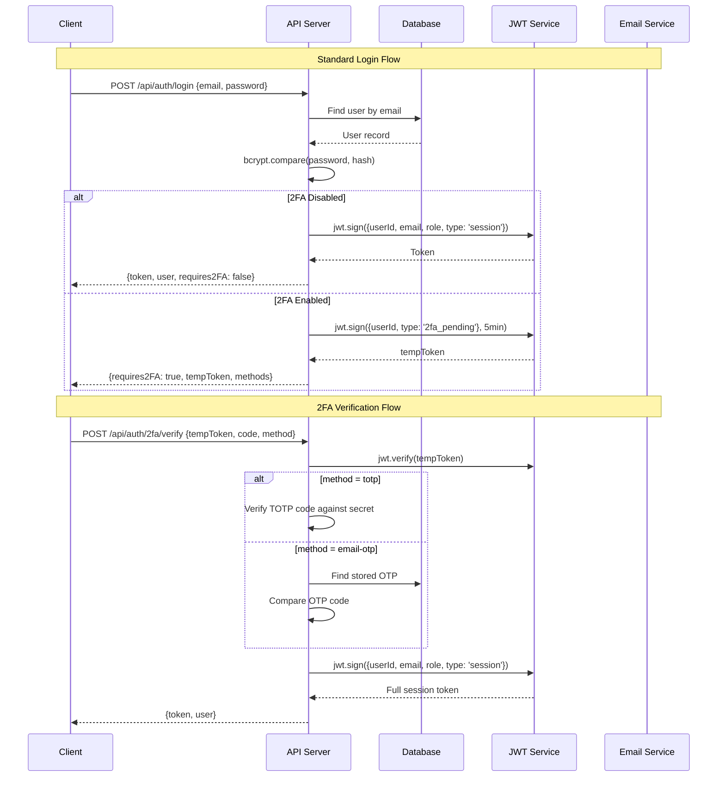
```mermaid
sequenceDiagram
    participant C as Client
    participant API as API Server
    participant DB as Database
    participant JWT as JWT Service
    participant EMAIL as Email Service

    Note over C,EMAIL: Standard Login Flow
    C->>API: POST /api/auth/login {email, password}
    API->>DB: Find user by email
    DB-->>API: User record
    API->>API: bcrypt.compare(password, hash)
    alt 2FA Disabled
        API->>JWT: jwt.sign({userId, email, role, type: 'session'})
        JWT-->>API: Token
        API-->>C: {token, user, requires2FA: false}
    else 2FA Enabled
        API->>JWT: jwt.sign({userId, type: '2fa_pending'}, 5min)
        JWT-->>API: tempToken
        API-->>C: {requires2FA: true, tempToken, methods}
    end

    Note over C,EMAIL: 2FA Verification Flow
    C->>API: POST /api/auth/2fa/verify {tempToken, code, method}
    API->>JWT: jwt.verify(tempToken)
    alt method = totp
        API->>API: Verify TOTP code against secret
    else method = email-otp
        API->>DB: Find stored OTP
        API->>API: Compare OTP code
    end
    API->>JWT: jwt.sign({userId, email, role, type: 'session'})
    JWT-->>API: Full session token
    API-->>C: {token, user}
```

### 5.2 Token Verification Strategy

The `verifyAuth()` function implements a three-tier token verification strategy:

1. **In-Memory Session Cache** (fastest) — Checks `sessions` Map for valid session entries. Used primarily in development and non-serverless environments.

2. **JWT Verification** (Vercel-compatible) — Decodes and verifies the JWT token using the `JWT_SECRET`. Works in serverless environments where in-memory state is not preserved.

3. **Database Session Lookup** (fallback) — Queries the `Session` table in the database for the token. Most reliable but slowest.

```typescript
// Token payload structure
interface JWTPayload {
  userId: string;
  email: string;
  name: string;
  role: string;
  type: 'session' | '2fa_pending';
  iat: number;
  exp: number;
}
```

### 5.3 Two-Factor Authentication (2FA)

The platform supports two 2FA methods:

#### TOTP (Time-based One-Time Password)

- Uses standard RFC 6238 TOTP algorithm
- Compatible with Google Authenticator, Authy, 1Password
- Secret stored in `User.twoFactorSecret`
- QR code generated via `otpauth://` URI scheme
- 8 backup codes generated on setup (single-use)

#### Email OTP

- 6-digit code sent to user's verified email
- Code expires after 5 minutes
- Rate limited: 5 requests per 5 minutes
- Used as fallback when authenticator app is unavailable

### 5.4 Role-Based Access Control (RBAC)

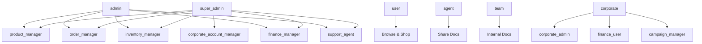
```mermaid
graph TD
    SUPER[super_admin] --> PM[product_manager]
    SUPER --> OM[order_manager]
    SUPER --> IM[inventory_manager]
    SUPER --> FM[finance_manager]
    SUPER --> SA[support_agent]
    SUPER --> CAM[corporate_account_manager]

    ADMIN[admin] --> PM
    ADMIN --> OM
    ADMIN --> IM
    ADMIN --> FM
    ADMIN --> SA

    USER[user] --> BROWSE[Browse & Shop]
    AGENT[agent] --> SHARE[Share Docs]
    TEAM[team] --> DOCS[Internal Docs]
    CORP[corporate] --> CORP_ADMIN[corporate_admin]
    CORP --> FIN_USER[finance_user]
    CORP --> CAMP_MGR[campaign_manager]
```

#### Role Definitions

| Role | Access Level | Key Capabilities |
|---|---|---|
| **admin** | Full platform access | All CRUD operations, user management, system config |
| **user** | Customer access | Browse, purchase, wishlist, reviews, try-on |
| **agent** | Sales agent | Document sharing, product recommendations, affiliate tracking |
| **team** | Internal team | Wiki/docs access, training materials, internal tools |
| **corporate** | Corporate portal | Campaign management, team management, corporate ordering |

#### Admin Sub-Roles

| Admin Role | Scope |
|---|---|
| `super_admin` | All admin capabilities + user management + system settings |
| `product_manager` | Product CRUD, category management, inventory |
| `order_manager` | Order processing, shipping, refunds |
| `inventory_manager` | Stock management, sync, import |
| `finance_manager` | Invoices, accounting, payment management |
| `support_agent` | Support tickets, user communication |
| `corporate_account_manager` | Corporate account approval, campaign oversight |

### 5.5 Session Management

Sessions are tracked in both the `Session` database table and an in-memory Map:

- **Token Expiry:** 7 days (configurable)
- **Concurrent Sessions:** Multiple sessions per user allowed
- **Session Refresh:** `POST /api/auth/refresh` extends expiry
- **Logout:** Deletes session from DB and in-memory store
- **Activity Tracking:** `lastActivity` updated on each API call
- **IP/Device Logging:** IP address and user agent stored per session

### 5.6 Password Security

```typescript
// Password requirements (password-validator.ts)
const requirements = {
  minLength: 8,
  maxLength: 128,
  minLowercase: 1,
  minUppercase: 1,
  minNumbers: 1,
  minSymbols: 1,
};

// Hashing: bcrypt with 12 salt rounds
const hash = await bcrypt.hash(password, 12);
const isValid = await bcrypt.compare(input, hash);
```

---

## 6. AI Integration

### 6.1 Virtual Try-On Pipeline (v4)

The AI Virtual Try-On is the platform's flagship feature, using a multi-strategy pipeline to generate photorealistic images of customers wearing products.

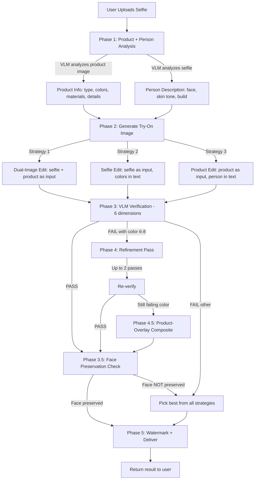
```mermaid
flowchart TD
    START[User Uploads Selfie] --> ANALYZE[Phase 1: Product + Person Analysis]
    ANALYZE --> |VLM analyzes product image| PROD_INFO[Product Info: type, colors, materials, details]
    ANALYZE --> |VLM analyzes selfie| PERSON_DESC[Person Description: face, skin tone, build]
    PROD_INFO --> GEN1[Phase 2: Generate Try-On Image]
    PERSON_DESC --> GEN1

    GEN1 --> |Strategy 1| DUAL[Dual-Image Edit: selfie + product as input]
    GEN1 --> |Strategy 2| SELFIE[Selfie Edit: selfie as input, colors in text]
    GEN1 --> |Strategy 3| PRODUCT[Product Edit: product as input, person in text]

    DUAL --> VERIFY[Phase 3: VLM Verification - 6 dimensions]
    SELFIE --> VERIFY
    PRODUCT --> VERIFY

    VERIFY --> |PASS| FACE_CHECK[Phase 3.5: Face Preservation Check]
    VERIFY --> |FAIL with color 6-8| REFINE[Phase 4: Refinement Pass]
    VERIFY --> |FAIL other| BEST[Pick best from all strategies]

    REFINE --> |Up to 2 passes| RE_VERIFY[Re-verify]
    RE_VERIFY --> |PASS| FACE_CHECK
    RE_VERIFY --> |Still failing color| OVERLAY[Phase 4.5: Product-Overlay Composite]
    OVERLAY --> FACE_CHECK

    FACE_CHECK --> |Face preserved| WATERMARK[Phase 5: Watermark + Deliver]
    FACE_CHECK --> |Face NOT preserved| BEST

    BEST --> WATERMARK
    WATERMARK --> RESULT[Return result to user]
```

#### Pipeline Phases

**Phase 1: Analysis**

Two VLM calls run in parallel:
1. **Product Analysis** — Extracts: TYPE, MAIN_COLOR (with hex + undertone), SECONDARY_COLOR, METAL_COLOR (warm/cool), MATERIALS, KEY_DETAILS, PATTERN_TEXTURE, SIZE_SCALE, COLOR_FAMILY
2. **Person Description** — Extracts: face shape, skin tone (warm/cool/neutral), hair, body build

**Phase 2: Multi-Strategy Generation**

Three generation strategies are attempted in priority order:

| Strategy | Images Provided | Strength | Weakness |
|---|---|---|---|
| **Dual-Image Edit** | Selfie + Product | Best color accuracy (model sees actual product) | May distort face |
| **Selfie Edit** | Selfie only | Best face preservation | Colors described in text (less accurate) |
| **Product Edit** | Product only | Best product fidelity | Face won't match |

**Phase 3: 6-Dimension VLM Verification**

The VLM compares the generated image against the original product image:

| Dimension | Weight | Threshold |
|---|---|---|
| COLOR_MATCH | 30% | ≥6 (auto-refine 6-8) |
| SHAPE_DESIGN | 20% | ≥7 |
| FACE_PRESERVATION | 20% | ≥7 |
| NATURAL_WEAR | 15% | ≥6 |
| SKIN_TONE | 15% | ≥7 |
| OVERALL | Composite | ≥6 |

**Phase 3.5: Face Preservation Check**

A dedicated VLM comparison between the generated image and the original selfie verifies that the person's face is preserved. This prevents accepting results where the product looks perfect but the person looks like someone else.

**Phase 4: Refinement (up to 2 passes)**

If COLOR_MATCH is between 6-8, an automatic refinement pass is triggered with specific correction instructions based on the VLM's ISSUE description. The refinement uses dual-image input with stronger color-matching emphasis.

**Phase 4.5: Product-Overlay Composite**

If color accuracy is still poor after refinement, a composite image is created:
1. The actual product image is overlaid on the generated result at partial opacity
2. A final AI blend pass smooths the composite
3. This guarantees product color accuracy at the cost of some naturalness

**Phase 5: Watermark and Deliver**

The final image is watermarked with the 3 Boxes branding and delivered to the client.

#### Category Configuration

Each product category has specific configuration for optimal try-on results:

| Category | Image Size | Body Type | Color Focus |
|---|---|---|---|
| Jewelry | 864x1152 | Close-up chest up | Metal tone, stone colors |
| Sarees | 768x1344 | Full-body | Fabric color, border, zari |
| Watches | 864x1152 | Waist up | Dial, case, strap colors |
| Fashion | 768x1344 | Full-body | Fabric, print, accent colors |
| Corporate Gifts | 864x1152 | Product-in-use | Product, packaging, branding |
| Kids Fashion | 768x1344 | Child/teenager full-body | Fabric, pattern, details |

**Jewelry Sub-type Detection:** The pipeline automatically detects jewelry sub-types from the product name and adjusts placement:
- "earring" / "jhumka" → "wearing earrings on both earlobes"
- "necklace" / "pendant" → "wearing a necklace around the neck"
- "bracelet" / "bangle" → "wearing a bracelet on the wrist"
- "ring" → "wearing a ring on the finger"
- "set" / "bridal" → "wearing a matching jewelry set"

### 6.2 AI Gift Advisor

The Gift Advisor is a 6-step conversational wizard that uses AI to recommend personalized gifts.

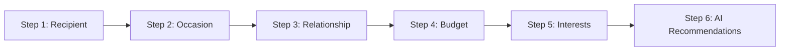
```mermaid
flowchart LR
    S1[Step 1: Recipient] --> S2[Step 2: Occasion]
    S2 --> S3[Step 3: Relationship]
    S3 --> S4[Step 4: Budget]
    S4 --> S5[Step 5: Interests]
    S5 --> S6[Step 6: AI Recommendations]
```

**Step 1 — Recipient Type:** him, her, couple, kids, parents, friend, colleague  
**Step 2 — Occasion:** birthday, anniversary, wedding, diwali, christmas, valentine's, housewarming, new job, farewell  
**Step 3 — Relationship:** spouse, parent, sibling, friend, colleague, boss, child  
**Step 4 — Budget Range:** ₹500-₹50,000 with smart brackets  
**Step 5 — Interests:** jewelry, fashion, watches, fragrances, leather, home, tech, wellness  
**Step 6 — AI Results:** Scored and ranked product recommendations with explanation

**Scoring Algorithm:**

```
product_score = (
  occasion_match * 0.25 +
  recipient_match * 0.20 +
  relationship_match * 0.15 +
  budget_fit * 0.15 +
  interest_match * 0.15 +
  rating_bonus * 0.10
)
```

### 6.3 Social Style Analysis

The Social Style Integration connects to Facebook, LinkedIn, and Instagram to analyze a user's fashion preferences.

**Analysis Pipeline:**

1. **OAuth Connection** — User connects social media accounts with explicit consent
2. **Data Extraction** — Public profile images, posts with fashion-related content
3. **AI Analysis** — VLM analyzes style patterns, color preferences, brand affinities
4. **Style Profile Generation** — Creates a structured style profile:
   ```json
   {
     "styleType": "classic-elegant",
     "colorPreferences": ["gold", "maroon", "navy"],
     "brandAffinities": ["traditional", "contemporary"],
     "categoryPreferences": ["jewelry", "sarees"],
     "budgetRange": "premium"
   }
   ```
5. **Personalized Recommendations** — Products matched against the style profile

**Consent Management:**
- Explicit opt-in required before any data access
- User can revoke access at any time
- Only public/available data is analyzed
- Original images are not stored unless user opts in
- Analysis results can be deleted on request

### 6.4 SmartBundle AI Validation

The SmartBundle engine uses AI to validate and optimize product bundles:

1. **Theme Coherence Check** — VLM verifies products share a visual theme
2. **Color Harmony Analysis** — Ensures bundle products have complementary colors
3. **Occasion Appropriateness** — Validates products match the stated occasion
4. **Price Optimization** — Suggests bundle pricing based on individual product values
5. **Gap Detection** — Identifies missing product types that would enhance the bundle

---

## 7. Product Management

### 7.1 Product Data Architecture

Products in 3 Boxes come from two sources:

1. **Internal Products** — Managed directly through the admin dashboard or synced from Shopify
2. **External Products** — Aggregated from 9 partner portals via affiliate links

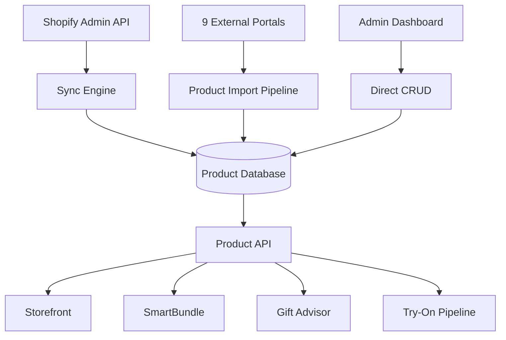
```mermaid
flowchart TD
    SHOPIFY[Shopify Admin API] --> SYNC[Sync Engine]
    PORTALS[9 External Portals] --> SCRAPE[Product Import Pipeline]
    ADMIN[Admin Dashboard] --> CRUD[Direct CRUD]

    SYNC --> DB[(Product Database)]
    SCRAPE --> DB
    CRUD --> DB

    DB --> API[Product API]
    API --> STORE[Storefront]
    API --> BUNDLE[SmartBundle]
    API --> GIFT[Gift Advisor]
    API --> TRYON[Try-On Pipeline]
```

### 7.2 Category Hierarchy

The platform uses a hierarchical category structure:

```
├── Couple
│   ├── Couple Friendly
│   └── Romantic Gifts
├── Men
│   ├── Accessories
│   ├── Shirts
│   ├── T-Shirts & Polos
│   ├── Fragrances
│   ├── Watches
│   └── Leather Goods
├── Women
│   ├── Jewelry
│   ├── Sarees
│   ├── Fashion
│   ├── Fragrances
│   └── Accessories
├── Kids
│   ├── Toys & Games
│   └── Kids Fashion
├── Home
│   ├── Home Décor
│   ├── Candles & Fragrances
│   └── Living
├── Office
│   ├── Corporate Gifts
│   ├── Desk Accessories
│   └── Stationery
└── New Arrivals
```

### 7.3 Product Variants

Products support multiple variants with individual pricing, stock, and attributes:

```json
{
  "name": "Diamond Necklace Set",
  "price": 15999,
  "variants": [
    {
      "name": "Gold Plated",
      "price": 15999,
      "attributes": "{\"plating\": \"Gold\", \"material\": \"Brass + Gold Plating\"}",
      "stock": 15,
      "image": "/images/products/necklace-gold.jpg"
    },
    {
      "name": "Silver Plated",
      "price": 12999,
      "attributes": "{\"plating\": \"Silver\", \"material\": \"Brass + Silver Plating\"}",
      "stock": 8,
      "image": "/images/products/necklace-silver.jpg"
    }
  ]
}
```

### 7.4 Product Occasion & Recipient Tagging

Products are tagged with structured metadata for intelligent filtering:

**Occasions:** birthday, anniversary, wedding, diwali, christmas, valentine's, housewarming, raksha-bandhan, eid, new-year, farewell, promotion

**Recipient Types:** him, her, couple, kids, parents, friend, colleague, boss, grandparents

**Relationships:** spouse, parent, sibling, friend, colleague, boss, child, student

These tags power the Gift Advisor, Family Shopping, and SmartBundle features.

### 7.5 External Platform Products

Products from external platforms carry additional metadata:

| Field | Description |
|---|---|
| `platform` | Source portal (myntra, amazon, etc.) |
| `sourceUrl` | Original product page URL |
| `affiliateUrl` | Tracking link with affiliate parameters |
| `affiliateId` | Affiliate network identifier |
| `commission` | Commission percentage earned on sale |
| `externalId` | Product ID on the source platform |
| `isExternal` | Flag distinguishing external products |
| `syncStatus` | active, paused, error, removed |
| `lastSyncedAt` | Last successful sync timestamp |

### 7.6 Inventory Management

Stock levels are tracked per product and per variant:

- **Stock Status:** Automatically computed from stock count
  - `in_stock`: stock > reorderLevel
  - `low_stock`: stock > 0 && stock <= reorderLevel
  - `out_of_stock`: stock = 0
  - `preorder`: stock = 0 but available for pre-order

- **Inventory Log:** Every stock change is recorded:
  - `in`: Stock received from vendor
  - `out`: Stock sold
  - `adjustment`: Manual correction
  - `return`: Customer return

- **Reorder Alerts:** When stock falls below `reorderLevel`, alerts are triggered

### 7.7 Image Management

Products support multiple images with sorting and variant-specific images:

- **Primary Image:** First image in the sorted `ProductImage` list
- **Variant Images:** Each variant can have its own image
- **Fallback Images:** Category-specific placeholder images when no product images exist
- **Image Proxy:** `/api/image-proxy` handles CORS and caching for external images
- **Image Optimization:** Sharp.js processes images server-side (resize, format conversion)
- **Watermark:** AI Try-On results are watermarked before delivery

---

## 8. Corporate Gifting

### 8.1 Corporate Account Lifecycle

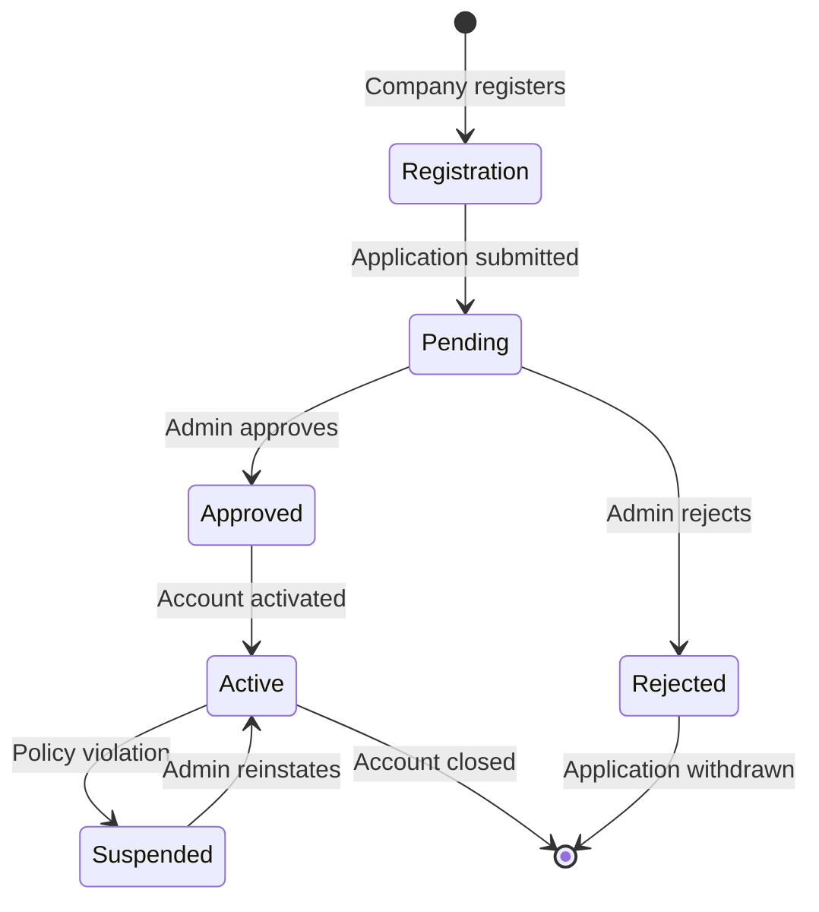
```mermaid
stateDiagram-v2
    [*] --> Registration: Company registers
    Registration --> Pending: Application submitted
    Pending --> Approved: Admin approves
    Pending --> Rejected: Admin rejects
    Approved --> Active: Account activated
    Active --> Suspended: Policy violation
    Suspended --> Active: Admin reinstates
    Active --> [*]: Account closed
    Rejected --> [*]: Application withdrawn
```

### 8.2 Corporate Account Features

- **Company Profile** — Name, industry, GST/PAN, billing/shipping addresses
- **Team Management** — Invite members with corporate_admin, finance_user, campaign_manager roles
- **Credit System** — Credit limit tracking with `creditLimit` and `creditUsed` fields
- **Corporate Discount** — Default discount percentage on all products
- **Custom Branding** — Logo, colors, packaging style, card templates
- **CSV Import** — Bulk import recipients from CSV files
- **Approval Workflow** — Campaigns require approval before execution

### 8.3 Campaign Management

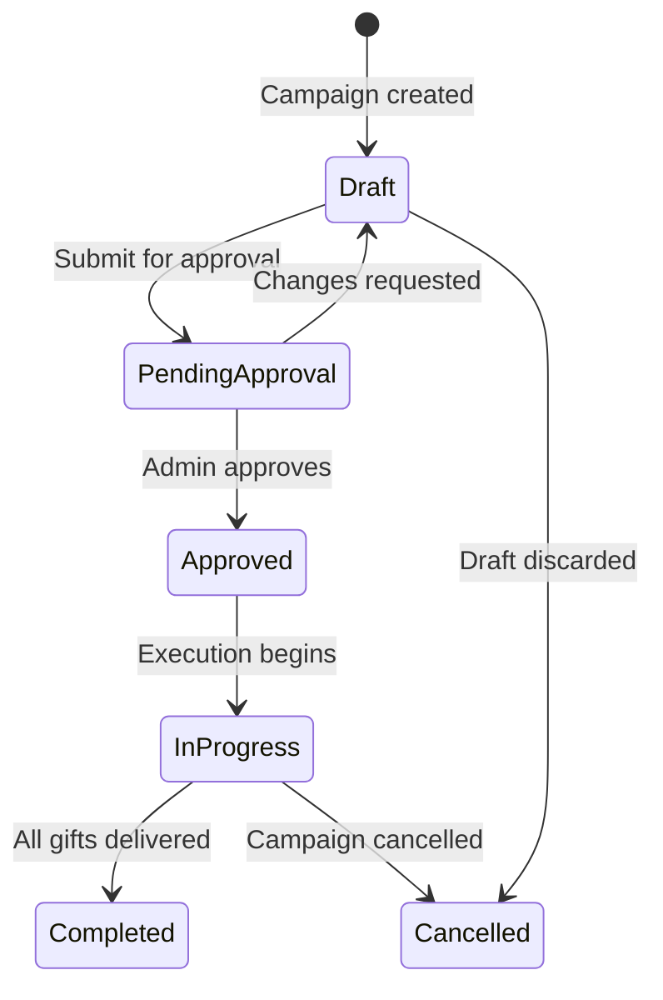
```mermaid
stateDiagram-v2
    [*] --> Draft: Campaign created
    Draft --> PendingApproval: Submit for approval
    PendingApproval --> Approved: Admin approves
    PendingApproval --> Draft: Changes requested
    Approved --> InProgress: Execution begins
    InProgress --> Completed: All gifts delivered
    InProgress --> Cancelled: Campaign cancelled
    Draft --> Cancelled: Draft discarded
```

**Campaign Fields:**
- Name, occasion, description
- Budget per recipient and total budget
- Delivery type (bulk or individual)
- Delivery date
- Default product and greeting message
- Per-recipient overrides (product, budget, message)

### 8.4 Corporate Branding

Each corporate account can customize their gift packaging:

| Setting | Options | Default |
|---|---|---|
| `logoUrl` | Custom logo URL | null |
| `primaryColor` | Hex color code | null |
| `secondaryColor` | Hex color code | null |
| `customMessage` | Default greeting | null |
| `packagingType` | standard / premium / luxury | standard |
| `giftWrapStyle` | Custom style | null |
| `includeBranding` | true / false | true |
| `hidePrice` | true / false | true |
| `cardTemplate` | Custom template | null |

### 8.5 Recipient Management

Recipients can be managed individually or bulk-imported:

**CSV Format:**
```csv
name,email,phone,designation,department,address,city,state,zipCode
John Smith,john@acme.com,+919876543210,VP Engineering,Technology,123 Tech Park,Mumbai,Maharashtra,400001
```

**Gift Status Tracking:**
- pending → ordered → shipped → delivered
- Can be cancelled at any point before delivery

---

## 9. Payment & Checkout

### 9.1 Checkout Flow

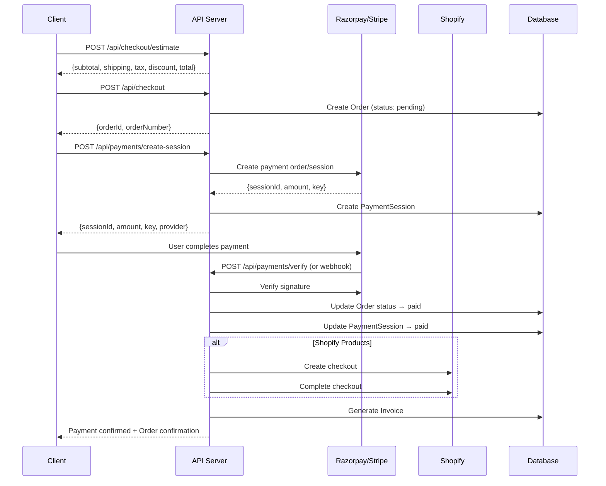
```mermaid
sequenceDiagram
    participant C as Client
    participant API as API Server
    participant RAZOR as Razorpay/Stripe
    participant SHOPIFY as Shopify
    participant DB as Database

    C->>API: POST /api/checkout/estimate
    API-->>C: {subtotal, shipping, tax, discount, total}

    C->>API: POST /api/checkout
    API->>DB: Create Order (status: pending)
    API-->>C: {orderId, orderNumber}

    C->>API: POST /api/payments/create-session
    API->>RAZOR: Create payment order/session
    RAZOR-->>API: {sessionId, amount, key}
    API->>DB: Create PaymentSession
    API-->>C: {sessionId, amount, key, provider}

    C->>RAZOR: User completes payment
    RAZOR->>API: POST /api/payments/verify (or webhook)
    API->>RAZOR: Verify signature
    API->>DB: Update Order status → paid
    API->>DB: Update PaymentSession → paid

    alt Shopify Products
        API->>SHOPIFY: Create checkout
        API->>SHOPIFY: Complete checkout
    end

    API->>DB: Generate Invoice
    API-->>C: Payment confirmed + Order confirmation
```

### 9.2 Payment Providers

#### Razorpay (Primary — India)

- **Methods:** UPI, Credit/Debit Cards, Net Banking, Wallets, EMI, Cardless EMI
- **Currency:** INR (primary)
- **Integration:** Order API → Payment Capture → Webhook verification
- **Signature Verification:** HMAC-SHA256 with Razorpay secret

#### Stripe (International)

- **Methods:** Cards, Apple Pay, Google Pay, SEPA, iDEAL
- **Currency:** Multi-currency support (USD, EUR, GBP, etc.)
- **Integration:** Checkout Session → Webhook events
- **Signature Verification:** Stripe-Signature header with webhook secret

### 9.3 Order States

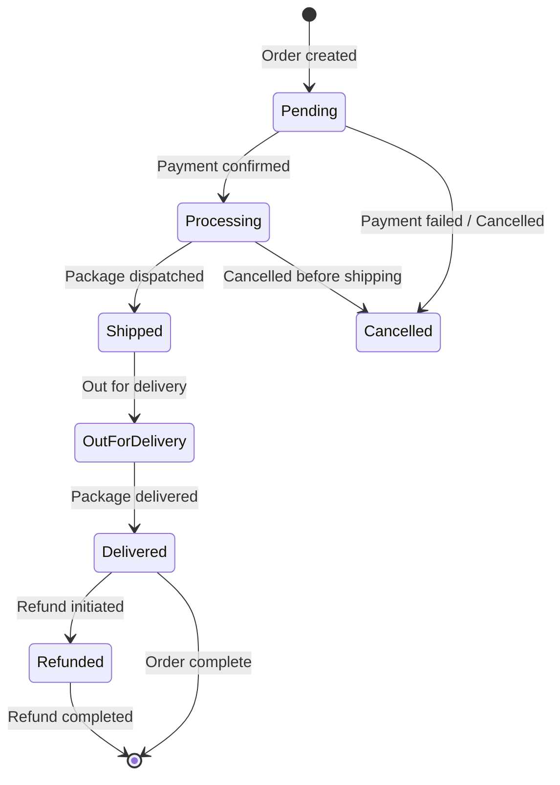
```mermaid
stateDiagram-v2
    [*] --> Pending: Order created
    Pending --> Processing: Payment confirmed
    Processing --> Shipped: Package dispatched
    Shipped --> OutForDelivery: Out for delivery
    OutForDelivery --> Delivered: Package delivered
    Pending --> Cancelled: Payment failed / Cancelled
    Processing --> Cancelled: Cancelled before shipping
    Delivered --> Refunded: Refund initiated
    Refunded --> [*]: Refund completed
    Delivered --> [*]: Order complete
```

### 9.4 Invoice Generation

Invoices are auto-generated for completed orders:

- **Invoice Number:** Sequential unique identifier
- **PDF Generation:** Server-side PDF creation
- **Contents:** Order details, items, amounts, tax breakdown, shipping info
- **Status Tracking:** generated → sent → paid
- **Corporate Invoicing:** GST-compliant invoices with company details

### 9.5 Coupon & Offer System

**Coupon Types:**
- `percentage` — Percentage discount (e.g., 10% off)
- `fixed` — Fixed amount discount (e.g., ₹500 off)
- `free_shipping` — Waives shipping charges

**Validation Rules:**
- Minimum order amount check
- Maximum discount cap
- Validity period check (validFrom → validTo)
- Usage limit enforcement (usageLimit vs usedCount)
- One coupon per order

---

## 10. Third-Party Integrations

### 10.1 Integration Architecture

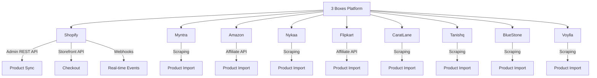
```mermaid
flowchart TD
    CORE[3 Boxes Platform] --> SHOPIFY[Shopify]
    CORE --> MYNTRA[Myntra]
    CORE --> AMAZON[Amazon]
    CORE --> NYKAA[Nykaa]
    CORE --> FLIPKART[Flipkart]
    CORE --> CARATLANE[CaratLane]
    CORE --> TANISHQ[Tanishq]
    CORE --> BLUESTONE[BlueStone]
    CORE --> VOYLLA[Voylla]

    SHOPIFY --> |Admin REST API| PRODUCTS[Product Sync]
    SHOPIFY --> |Storefront API| CHECKOUT[Checkout]
    SHOPIFY --> |Webhooks| EVENTS[Real-time Events]

    MYNTRA --> |Scraping| IMPORT1[Product Import]
    AMAZON --> |Affiliate API| IMPORT2[Product Import]
    NYKAA --> |Scraping| IMPORT3[Product Import]
    FLIPKART --> |Affiliate API| IMPORT4[Product Import]
    CARATLANE --> |Scraping| IMPORT5[Product Import]
    TANISHQ --> |Scraping| IMPORT6[Product Import]
    BLUESTONE --> |Scraping| IMPORT7[Product Import]
    VOYLLA --> |Scraping| IMPORT8[Product Import]
```

### 10.2 Shopify Integration

Shopify is the primary e-commerce backend for 3boxes.in.

**Configuration:**

| Setting | Value |
|---|---|
| Store Domain | `3boxesluxury-2.myshopify.com` |
| API Version | `2024-10` |
| Auth Method | Admin API Token (X-Shopify-Access-Token) |
| Cache TTL | 5 minutes |
| Pagination | Link-header based (250 per page) |

**Key Operations:**

| Operation | Endpoint | Purpose |
|---|---|---|
| Product Sync | `GET /admin/api/2024-10/products.json` | Fetch all active products |
| Collection Sync | `GET /admin/api/2024-10/{custom\|smart}_collections.json` | Fetch category hierarchy |
| Checkout Create | Storefront API | Create Shopify checkout for orders |
| Webhook Register | `POST /admin/api/2024-10/webhooks.json` | Register for order/product events |
| Product Count | `GET /admin/api/2024-10/products/count.json` | Health check |

**Product Deduplication:**
- First by Shopify numeric ID
- Then by product handle/slug
- Warning logged when duplicates are removed

**Category Mapping:**
- Shopify product types are mapped to 3 Boxes categories
- 70+ product type mappings defined
- Unmapped types create new categories automatically

### 10.3 External Portal Integrations

| Portal | Category | Integration Method | Commission |
|---|---|---|---|
| **Myntra** | Fashion, Accessories | Web scraping + Affiliate | 5-12% |
| **Amazon** | All categories | Affiliate API | 3-8% |
| **Nykaa** | Beauty, Jewelry, Fashion | Web scraping + Affiliate | 6-15% |
| **Flipkart** | All categories | Affiliate API | 4-10% |
| **CaratLane** | Jewelry (Titan) | Web scraping + Affiliate | 8-12% |
| **Tanishq** | Jewelry (Titan) | Web scraping + Affiliate | 6-10% |
| **BlueStone** | Jewelry | Web scraping + Affiliate | 7-12% |
| **Voylla** | Fashion Jewelry | Web scraping + Affiliate | 8-15% |

### 10.4 Product Import Pipeline

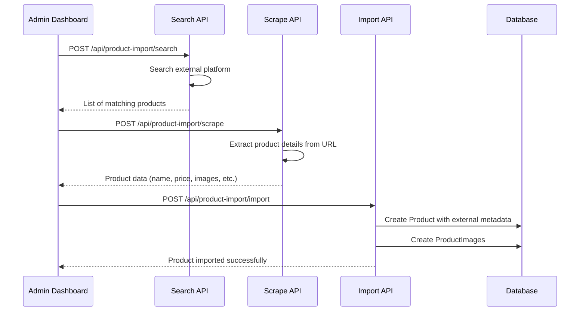
```mermaid
sequenceDiagram
    participant ADMIN as Admin Dashboard
    participant SEARCH as Search API
    participant SCRAPE as Scrape API
    participant IMPORT as Import API
    participant DB as Database

    ADMIN->>SEARCH: POST /api/product-import/search
    SEARCH->>SEARCH: Search external platform
    SEARCH-->>ADMIN: List of matching products

    ADMIN->>SCRAPE: POST /api/product-import/scrape
    SCRAPE->>SCRAPE: Extract product details from URL
    SCRAPE-->>ADMIN: Product data (name, price, images, etc.)

    ADMIN->>IMPORT: POST /api/product-import/import
    IMPORT->>DB: Create Product with external metadata
    IMPORT->>DB: Create ProductImages
    IMPORT-->>ADMIN: Product imported successfully
```

### 10.5 Affiliate Click Tracking

Every outbound click to an external platform is tracked:

```typescript
interface AffiliateClick {
  productId: string;      // Local product ID
  platform: string;       // Target platform
  sourceUrl: string;      // External URL clicked
  referralCode: string;   // Affiliate referral code
  ipAddress: string;      // Client IP
  userAgent: string;      // Client browser
  clickedAt: DateTime;    // Click timestamp
}
```

Click statistics are available at `/api/affiliate/stats`.

---

## 11. Social Style Integration

### 11.1 OAuth Connection Flow

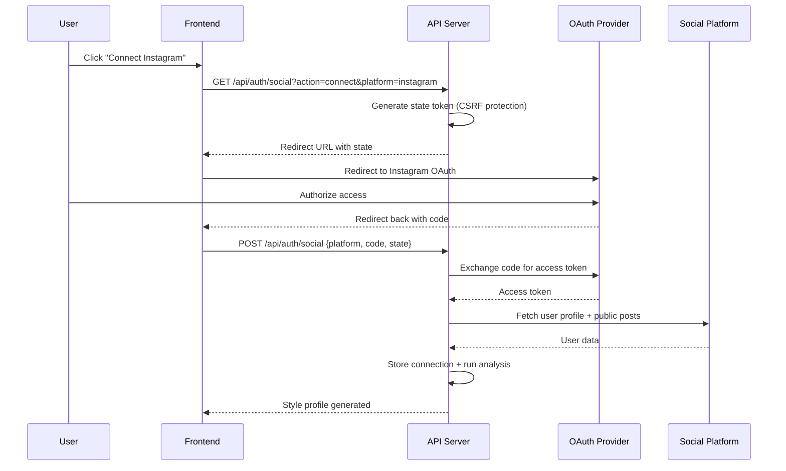
```mermaid
sequenceDiagram
    participant USER as User
    participant FE as Frontend
    participant API as API Server
    participant OAUTH as OAuth Provider
    participant SOCIAL as Social Platform

    USER->>FE: Click "Connect Instagram"
    FE->>API: GET /api/auth/social?action=connect&platform=instagram
    API->>API: Generate state token (CSRF protection)
    API-->>FE: Redirect URL with state
    FE->>OAUTH: Redirect to Instagram OAuth
    USER->>OAUTH: Authorize access
    OAUTH-->>FE: Redirect back with code
    FE->>API: POST /api/auth/social {platform, code, state}
    API->>OAUTH: Exchange code for access token
    OAUTH-->>API: Access token
    API->>SOCIAL: Fetch user profile + public posts
    SOCIAL-->>API: User data
    API->>API: Store connection + run analysis
    API-->>FE: Style profile generated
```

### 11.2 Supported Platforms

| Platform | Data Accessed | Scope |
|---|---|---|
| **Facebook** | Public profile, photos | `public_profile`, `user_photos` |
| **LinkedIn** | Professional profile | `r_liteprofile`, `r_emailaddress` |
| **Instagram** | Public media, profile | `instagram_basic`, `instagram_content_publish` |

### 11.3 Consent Management

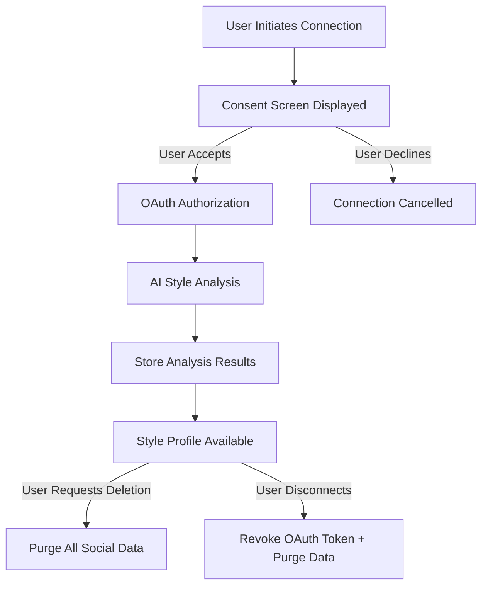
```mermaid
flowchart TD
    CONNECT[User Initiates Connection] --> CONSENT[Consent Screen Displayed]
    CONSENT --> |User Accepts| AUTH[OAuth Authorization]
    CONSENT --> |User Declines| CANCEL[Connection Cancelled]
    AUTH --> ANALYZE[AI Style Analysis]
    ANALYZE --> STORE[Store Analysis Results]
    STORE --> PROFILE[Style Profile Available]
    PROFILE --> |User Requests Deletion| DELETE[Purge All Social Data]
    PROFILE --> |User Disconnects| REVOKE[Revoke OAuth Token + Purge Data]
```

**Consent Requirements:**
1. Explicit opt-in before any data access
2. Clear explanation of what data will be accessed
3. User can revoke access at any time
4. Original social media images are not stored unless user opts in
5. Only analysis results (style preferences) are persisted
6. Full data deletion on request (GDPR/DPDP Act compliant)

### 11.4 AI Fashion Analysis

The VLM-based fashion analysis extracts:

```json
{
  "styleType": "classic-elegant | modern-chic | bohemian | traditional | casual-smart",
  "colorPreferences": {
    "primary": ["navy", "white", "gold"],
    "secondary": ["maroon", "cream"],
    "avoid": ["neon", "pastel"]
  },
  "categoryAffinities": {
    "jewelry": 0.9,
    "sarees": 0.7,
    "watches": 0.6,
    "fashion": 0.5
  },
  "styleAttributes": {
    "formality": "semi-formal",
    "boldness": "moderate",
    "traditionalVsContemporary": "balanced",
    "minimalismVsMaximalism": "moderate"
  },
  "recommendationBoost": {
    "goldJewelry": 1.5,
    "silkSarees": 1.3,
    "leatherGoods": 0.8
  }
}
```

---

## 12. 3Box Curate / SmartBundle

### 12.1 Cross-Portal Aggregation

3Box Curate aggregates products from 9 external portals into curated bundles:

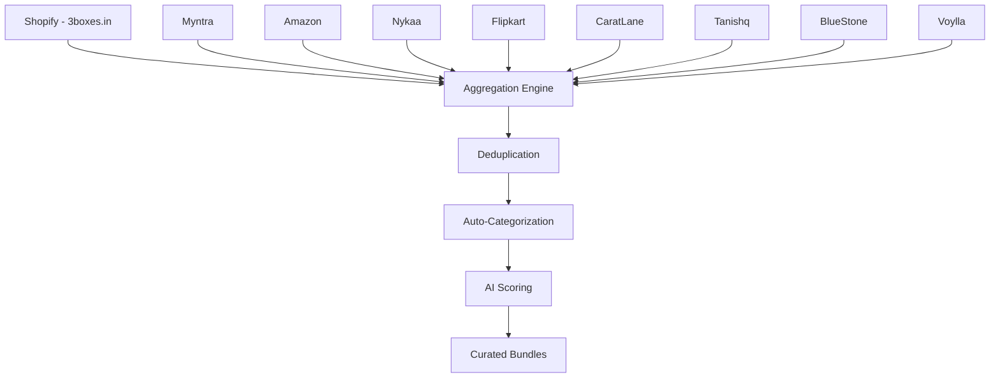
```mermaid
flowchart TD
    P1[Shopify - 3boxes.in] --> AGG[Aggregation Engine]
    P2[Myntra] --> AGG
    P3[Amazon] --> AGG
    P4[Nykaa] --> AGG
    P5[Flipkart] --> AGG
    P6[CaratLane] --> AGG
    P7[Tanishq] --> AGG
    P8[BlueStone] --> AGG
    P9[Voylla] --> AGG

    AGG --> DEDUP[Deduplication]
    DEDUP --> CATEGORIZE[Auto-Categorization]
    CATEGORIZE --> SCORE[AI Scoring]
    SCORE --> CURATE[Curated Bundles]
```

### 12.2 SmartBundle Creation Flow

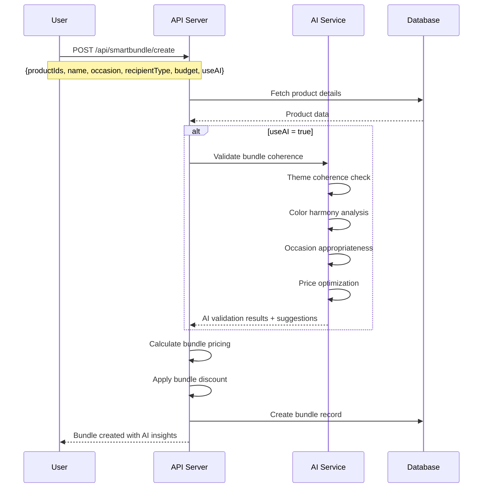
```mermaid
sequenceDiagram
    participant USER as User
    participant API as API Server
    participant AI as AI Service
    participant DB as Database

    USER->>API: POST /api/smartbundle/create
    Note over USER,API: {productIds, name, occasion, recipientType, budget, useAI}

    API->>DB: Fetch product details
    DB-->>API: Product data

    alt useAI = true
        API->>AI: Validate bundle coherence
        AI->>AI: Theme coherence check
        AI->>AI: Color harmony analysis
        AI->>AI: Occasion appropriateness
        AI->>AI: Price optimization
        AI-->>API: AI validation results + suggestions
    end

    API->>API: Calculate bundle pricing
    API->>API: Apply bundle discount
    API->>DB: Create bundle record
    API-->>USER: Bundle created with AI insights
```

### 12.3 Bundle Logic

**Pricing:**
- Bundle discount: 5-15% based on product count
- 2 products: 5% off
- 3 products: 8% off
- 4+ products: 12-15% off

**AI Validation Checks:**
1. **Theme Coherence** — Do the products share a visual or thematic connection?
2. **Color Harmony** — Are the product colors complementary?
3. **Occasion Match** — Do all products fit the stated occasion?
4. **Recipient Match** — Are all products appropriate for the recipient type?
5. **Budget Compliance** — Does the total fall within the stated budget?
6. **Gap Detection** — Is there a missing product type that would enhance the bundle?

### 12.4 Combo Suggestions

The `/api/combo-suggestions` endpoint generates product combination ideas:

**Algorithm:**
1. Start with a base product
2. Find products in complementary categories
3. Score each combination using AI validation
4. Rank by coherence score + price fit
5. Return top 5 combinations

---

## 13. Family Shopping

### 13.1 Occasion Engine

The Family Shopping feature provides pre-curated packages based on Indian festivals and occasions:

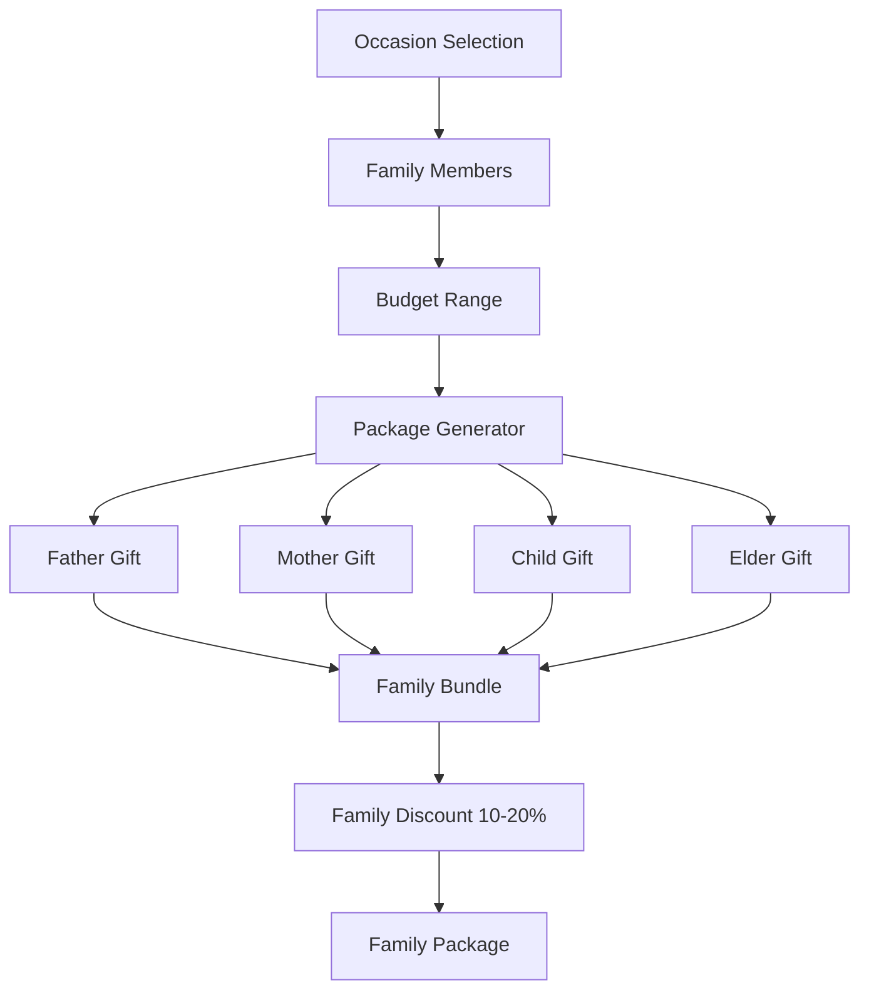
```mermaid
flowchart TD
    OCCASION[Occasion Selection] --> MEMBERS[Family Members]
    MEMBERS --> BUDGET[Budget Range]
    BUDGET --> GENERATE[Package Generator]

    GENERATE --> FATHER[Father Gift]
    GENERATE --> MOTHER[Mother Gift]
    GENERATE --> CHILD[Child Gift]
    GENERATE --> ELDER[Elder Gift]

    FATHER --> BUNDLE[Family Bundle]
    MOTHER --> BUNDLE
    CHILD --> BUNDLE
    ELDER --> BUNDLE

    BUNDLE --> DISCOUNT[Family Discount 10-20%]
    DISCOUNT --> RESULT[Family Package]
```

### 13.2 Supported Occasions

| Occasion | Key | Family Roles | Typical Budget |
|---|---|---|---|
| Diwali | `diwali` | All family members | ₹5,000-₹50,000 |
| Christmas | `christmas` | All family members | ₹3,000-₹30,000 |
| Raksha Bandhan | `raksha-bandhan` | Brother-Sister | ₹1,000-₹10,000 |
| Wedding | `wedding` | Couple + Family | ₹10,000-₹1,00,000 |
| Birthday | `birthday` | Individual | ₹500-₹20,000 |
| Anniversary | `anniversary` | Couple | ₹2,000-₹50,000 |
| Eid | `eid` | All family members | ₹3,000-₹30,000 |
| Pongal/Makar Sankranti | `pongal` | All family members | ₹2,000-₹20,000 |
| Navratri | `navratri` | All family members | ₹3,000-₹25,000 |
| Holi | `holi` | All family members | ₹1,000-₹15,000 |

### 13.3 Family Profiling

Each family member is profiled with:

```json
{
  "role": "father | mother | son | daughter | grandfather | grandmother | brother | sister",
  "age": 45,
  "interests": ["watches", "leather", "fragrances"],
  "stylePreference": "classic",
  "budgetAllocation": 0.3
}
```

The `budgetAllocation` field determines what percentage of the total budget is allocated to each member, with automatic rebalancing when members are added or removed.

### 13.4 Package Generation

The package generator:

1. Takes the total budget and splits it across family members based on `budgetAllocation`
2. For each member, finds the best-matching products based on role, age, interests, and occasion
3. Applies AI scoring to ensure each product is age-appropriate and occasion-fitting
4. Validates the complete package for coherence (no duplicate categories, color harmony)
5. Applies family discount (10-20% based on package size)
6. Returns the complete package with individual and total pricing

---

## 14. Real-time Features

### 14.1 WebSocket Architecture

```mermaid
flowchart TD
    CLIENT[Client App] --> |Socket.io Client| WS[WebSocket Server]
    WS --> |Event: order-update| CLIENT
    WS --> |Event: try-on-progress| CLIENT
    WS --> |Event: campaign-update| CLIENT
    WS --> |Event: support-message| CLIENT

    WS --> ROOM_ORDER[Order Room]
    WS --> ROOM_TRYON[Try-On Room]
    WS --> ROOM_ADMIN[Admin Room]
    WS --> ROOM_SUPPORT[Support Room]
```

### 14.2 Real-time Events

| Event | Room | Payload | Description |
|---|---|---|---|
| `order-update` | `order:{orderId}` | `{status, trackingEvent}` | Order status changes |
| `try-on-progress` | `tryon:{jobId}` | `{phase, progress, status}` | Try-On pipeline progress |
| `try-on-complete` | `tryon:{jobId}` | `{imageUrl, colorAccuracy}` | Try-On result ready |
| `campaign-update` | `campaign:{campaignId}` | `{status, recipientUpdate}` | Campaign progress |
| `support-message` | `ticket:{ticketId}` | `{message, senderId}` | New support message |
| `admin-notification` | `admin` | `{type, data}` | Admin dashboard alerts |
| `inventory-alert` | `admin` | `{productId, stock, status}` | Low stock warnings |

### 14.3 Try-On Progress Streaming

The AI Try-On pipeline provides real-time progress updates:

```
Phase 1: product-analysis → "AI is analyzing the product..."
Phase 2: generation → "Generating your style preview..."
Phase 3: verification → "Quality check in progress..."
Phase 3.5: face-check → "Verifying face preservation..."
Phase 4: refinement → "Enhancing color accuracy..."
Phase 5: watermark → "Adding final touches..."
Complete: → "Your style preview is ready!"
```

### 14.4 Connection Management

- **Authentication:** WebSocket connections require a valid JWT token
- **Room Joining:** Clients join rooms based on their active context (order, try-on job, etc.)
- **Heartbeat:** 30-second ping/pong to detect stale connections
- **Reconnection:** Automatic reconnection with exponential backoff
- **Rate Limiting:** Max 10 messages per second per connection

---

## 15. Security

### 15.1 Security Architecture

```mermaid
flowchart TD
    REQUEST[Incoming Request] --> CORS[CORS Check]
    CORS --> RATE[Rate Limiter]
    RATE --> AUTH[Authentication]
    AUTH --> PERM[Authorization]
    PERM --> INPUT[Input Validation]
    INPUT --> LOGIC[Business Logic]
    LOGIC --> ENCRYPT[Encryption Check]
    ENCRYPT --> AUDIT[Audit Logging]
    AUDIT --> RESPONSE[Response]

    RATE --> |429| BLOCKED[Blocked]
    AUTH --> |401| BLOCKED
    PERM --> |403| BLOCKED
    INPUT --> |400| BLOCKED
```

### 15.2 Rate Limiting

In-memory rate limiting per IP address and endpoint:

| Endpoint | Max Requests | Window |
|---|---|---|
| `login` | 5 | 15 minutes |
| `otp-login` | 3 | 5 minutes |
| `register` | 3 | 1 hour |
| `forgot-password` | 3 | 15 minutes |
| `2fa-verify` | 5 | 5 minutes |
| `try-on` | 10 | 1 hour |
| `ai-proxy` | 20 | 1 hour |
| Default API | 100 | 1 minute |

**Implementation Details:**
- Key format: `${endpoint}:${ipAddress}`
- Cleanup interval: 10 minutes (removes expired entries)
- Headers: `Retry-After` on 429 responses
- IP Extraction: `x-forwarded-for` → `x-real-ip` → "unknown"

### 15.3 Encryption

**AES-256-GCM** encryption for sensitive fields:

```typescript
// Encrypted fields:
// - User.phone
// - CorporateAccount.gstNumber
// - CorporateAccount.panNumber
// - CorporateAccount.billingAddress

// Format: iv:tag:encrypted (all hex encoded)
// Key: 32 bytes from ENCRYPTION_KEY env variable
// IV: 16 random bytes per encryption
// Auth Tag: 16 bytes for integrity verification

// Backward compatibility: Unencrypted values are returned as-is
```

### 15.4 Password Security

- **Algorithm:** bcrypt with 12 salt rounds
- **Requirements:** Minimum 8 chars, 1 uppercase, 1 lowercase, 1 number, 1 symbol
- **Maximum Length:** 128 characters (prevents DoS)
- **Validation:** Zod schema validation before hashing

### 15.5 JWT Security

- **Algorithm:** HS256
- **Secret:** `JWT_SECRET` env variable (or dev default)
- **Token Expiry:** 7 days
- **2FA Temp Token:** 5 minutes
- **Payload:** userId, email, name, role, type, iat, exp

### 15.6 XSS Protection

- **Input Sanitization:** All user inputs are validated with Zod schemas
- **Output Encoding:** React's built-in XSS protection (JSX auto-escapes)
- **Content Security Policy:** Configured via Next.js headers
- **HTML Stripping:** Shopify product descriptions are stripped of HTML tags

### 15.7 CSRF Protection

- **SameSite Cookies:** Session cookies use SameSite=Strict
- **State Parameter:** OAuth flows use CSRF state tokens
- **Origin Validation:** API validates Origin/Referer headers for sensitive operations

### 15.8 Audit Logging

All significant actions are logged to the `AuditLog` table:

| Action | Entity | Details |
|---|---|---|
| `login` | user | Login method, IP, device |
| `logout` | user | Session ID |
| `password_change` | user | Old vs new hash verification |
| `role_change` | user | Old role, new role, changed by |
| `approval_change` | user | Status, reason |
| `mfa_setup` | user | Method (totp/email-otp) |
| `mfa_disable` | user | Reason |
| `order_create` | order | Order number, total |
| `order_cancel` | order | Reason |
| `refund_process` | order | Amount, reason |
| `campaign_create` | campaign | Campaign ID |
| `campaign_approve` | campaign | Approved by |
| `corporate_register` | corporate | Company name |
| `corporate_approve` | corporate | Approved by |

### 15.9 API Key Protection

- Shopify Admin API token stored in env variable
- Payment gateway keys in env variables
- AI API key (Z-AI) in env variable
- Encryption key in env variable
- All secrets excluded from version control via `.gitignore`

---

## 16. Performance

### 16.1 Caching Strategy

```mermaid
flowchart TD
    REQUEST[API Request] --> L1[In-Memory Cache]
    L1 --> |Hit| RESPONSE[Return Cached Data]
    L1 --> |Miss| L2[Next.js Cache]
    L2 --> |Hit| L1
    L2 --> |Miss| DB[Database/External API]
    DB --> L2
    L2 --> L1
    L1 --> RESPONSE
```

**Cache Layers:**

| Layer | Technology | TTL | Use Case |
|---|---|---|---|
| **L1: In-Memory** | JavaScript Map | 5 minutes | Shopify products, categories, sessions |
| **L2: Next.js** | fetch revalidate | 5 minutes | Shopify API responses |
| **L3: Static** | SSG/ISR | Build time | Category pages, landing pages |
| **L4: Client** | React Query | Configurable | Product lists, user data |

**Shopify Cache:**
- Products cached for 5 minutes in memory
- Categories cached for 5 minutes in memory
- Manual invalidation via `invalidateShopifyCache()`
- Next.js `revalidate: 300` on Shopify API fetches

### 16.2 Image Optimization

- **Sharp.js:** Server-side image processing (resize, format conversion, watermarking)
- **Next.js Image:** Automatic lazy loading, format optimization (WebP/AVIF)
- **Image Proxy:** `/api/image-proxy` handles CORS and caching for external images
- **Fallback Images:** Category-specific placeholders when product images are missing
- **Deterministic Selection:** Product ID-based image selection ensures consistency

### 16.3 Code Splitting & Lazy Loading

- **Dynamic Imports:** Heavy components (Try-On Dialog, Gift Builder) are dynamically imported
- **Route-Based Splitting:** Each page is a separate chunk
- **Component-Level:** shadcn/ui components are tree-shakeable
- **Image Lazy Loading:** Next.js Image component with `loading="lazy"`

### 16.4 Database Optimization

- **SQLite (Dev):** Fast local development with zero configuration
- **PostgreSQL (Prod):** Production-grade with connection pooling
- **Prisma Query Optimization:** Select only needed fields, use includes judiciously
- **Pagination:** All list endpoints support cursor/offset pagination
- **Indexing:** Unique constraints on frequently queried fields (email, slug, token)

### 16.5 API Performance

- **Rate Limiting:** Prevents API abuse
- **Request Batching:** Parallel API calls where possible (e.g., product + person analysis)
- **Response Compression:** gzip/brotli via Vercel
- **Edge Caching:** Vercel Edge Network for static assets
- **Try-On Pipeline:** Rate-limited AI API calls with 1200ms delay between calls

---

## 17. Deployment

### 17.1 Deployment Architecture

```mermaid
flowchart TD
    CODE[Source Code] --> GIT[Git Repository]
    GIT --> VERCEL[Vercel Build]
    VERCEL --> |Build| BUILD[Next.js Build]
    BUILD --> |prisma generate| PRISMA[Prisma Client]
    PRISMA --> |SQLite→PostgreSQL| SWITCH[DB Provider Switch]
    SWITCH --> DEPLOY[Vercel Deployment]

    DEPLOY --> EDGE[Vercel Edge Network]
    EDGE --> USERS[Global Users]

    subgraph "Vercel Configuration"
        ENV[Environment Variables]
        BLOB_STORAGE[Vercel Blob Storage]
        SERVERLESS[Serverless Functions]
    end

    DEPLOY --> ENV
    DEPLOY --> BLOB_STORAGE
    DEPLOY --> SERVERLESS
```

### 17.2 Build Process

The Vercel build process:

1. **Prisma Generate** — Creates the Prisma client
2. **DB Provider Switch** — `sed` command switches SQLite to PostgreSQL for production
3. **Next.js Build** — Compiles the application with production optimizations
4. **Static Generation** — Pre-renders static pages at build time
5. **Serverless Bundling** — API routes become serverless functions

**Build Command:**
```bash
# Vercel build (from package.json)
"vercel-build": "sed -i 's/provider = \"sqlite\"/provider = \"postgresql\"/g' prisma/schema.prisma && prisma generate && next build"
```

### 17.3 Environment Variables

| Variable | Required | Description |
|---|---|---|
| `DATABASE_URL` | Yes | Database connection string (SQLite or PostgreSQL) |
| `JWT_SECRET` | Yes | Secret for JWT token signing |
| `ENCRYPTION_KEY` | Yes | 32-byte hex key for AES-256-GCM |
| `SHOPIFY_STORE_DOMAIN` | Yes | Shopify store domain |
| `SHOPIFY_ADMIN_API_TOKEN` | Yes | Shopify Admin API access token |
| `RAZORPAY_KEY_ID` | No | Razorpay API key |
| `RAZORPAY_KEY_SECRET` | No | Razorpay API secret |
| `STRIPE_SECRET_KEY` | No | Stripe API secret |
| `STRIPE_WEBHOOK_SECRET` | No | Stripe webhook signing secret |
| `SMTP_HOST` | No | Email server hostname |
| `SMTP_PORT` | No | Email server port |
| `SMTP_USER` | No | Email server username |
| `SMTP_PASS` | No | Email server password |
| `ZAI_API_KEY` | No | Z-AI API key for AI features |
| `NEXT_PUBLIC_BASE_URL` | No | Public base URL for the application |
| `FACEBOOK_APP_ID` | No | Facebook OAuth app ID |
| `LINKEDIN_CLIENT_ID` | No | LinkedIn OAuth client ID |
| `INSTAGRAM_CLIENT_ID` | No | Instagram OAuth client ID |

### 17.4 Docker Deployment

For self-hosted deployments:

```dockerfile
FROM oven/bun:1 AS base
WORKDIR /app

# Install dependencies
COPY package.json bun.lock ./
RUN bun install --frozen-lockfile

# Copy source
COPY . .

# Generate Prisma client
RUN bunx prisma generate

# Build
RUN bun run build

# Expose port
EXPOSE 3000

# Start
CMD ["bun", "start"]
```

### 17.5 Development Scripts

| Script | Command | Purpose |
|---|---|---|
| `dev` | `next dev -p 3000` | Development server |
| `build` | `prisma generate && next build` | Production build |
| `start` | `NODE_ENV=production bun .next/standalone/server.js` | Production start |
| `lint` | `eslint .` | Code linting |
| `db:push` | `prisma db push` | Push schema to database |
| `db:generate` | `prisma generate` | Generate Prisma client |
| `db:migrate` | `prisma migrate dev` | Run migrations |
| `db:reset` | `prisma migrate reset` | Reset database |
| `db:seed` | `tsx prisma/seed.ts` | Seed database |

### 17.6 Monitoring & Logging

- **API Logging:** `api-logger.ts` logs all API calls with method, path, status, duration
- **Error Tracking:** Console error logging with context
- **Shopify Sync Logs:** `SyncLog` table tracks all product sync operations
- **Audit Logs:** `AuditLog` table tracks all significant user actions
- **Try-On Pipeline Logs:** Detailed pipeline phase logging with job IDs

### 17.7 Scaling Considerations

| Component | Current | Scaling Strategy |
|---|---|---|
| **API Server** | Vercel Serverless | Auto-scales with traffic |
| **Database** | SQLite/PostgreSQL | Migrate to managed PostgreSQL (Supabase/Neon) |
| **Session Store** | In-memory | Move to Redis for multi-instance |
| **Rate Limiter** | In-memory | Move to Redis for consistent limits |
| **File Storage** | Vercel Blob | Already cloud-scalable |
| **AI Pipeline** | Sequential | Queue-based processing with BullMQ |
| **WebSocket** | Single server | Socket.io Redis adapter for multi-instance |

### 17.8 CI/CD Pipeline

1. **Push to main** → Vercel auto-deploys
2. **Preview Deployments** → Every PR gets a preview URL
3. **Build Verification** → ESLint + TypeScript check
4. **Database Migrations** → Run manually via `prisma migrate deploy`
5. **Post-Deploy Verification** → Health check on `/api/shopify/status`

---

## Appendix

### A. Error Code Reference

| Code | HTTP Status | Description |
|---|---|---|
| `AUTH_INVALID_CREDENTIALS` | 401 | Email or password is incorrect |
| `AUTH_ACCOUNT_PENDING` | 403 | Account awaiting admin approval |
| `AUTH_ACCOUNT_SUSPENDED` | 403 | Account has been suspended |
| `AUTH_2FA_REQUIRED` | 403 | Two-factor authentication required |
| `AUTH_2FA_INVALID` | 401 | Invalid 2FA code |
| `AUTH_TOKEN_EXPIRED` | 401 | JWT token has expired |
| `AUTH_TOKEN_INVALID` | 401 | JWT token is malformed or invalid |
| `PERMISSION_DENIED` | 403 | User lacks required permission |
| `PRODUCT_NOT_FOUND` | 404 | Product ID does not exist |
| `PRODUCT_OUT_OF_STOCK` | 409 | Product has insufficient stock |
| `ORDER_NOT_FOUND` | 404 | Order ID does not exist |
| `ORDER_CANNOT_CANCEL` | 409 | Order cannot be cancelled at this status |
| `PAYMENT_FAILED` | 402 | Payment processing failed |
| `PAYMENT_VERIFICATION_FAILED` | 402 | Payment signature verification failed |
| `COUPON_INVALID` | 400 | Coupon code is invalid or expired |
| `COUPON_MIN_ORDER` | 400 | Order total below coupon minimum |
| `COUPON_USAGE_EXCEEDED` | 400 | Coupon usage limit reached |
| `TRYON_FAILED` | 500 | Try-On pipeline failed to generate result |
| `TRYON_RATE_LIMITED` | 429 | Try-On rate limit exceeded |
| `INTEGRATION_SYNC_FAILED` | 502 | Platform sync failed |
| `INTEGRATION_UNAVAILABLE` | 503 | External platform unavailable |
| `CORPORATE_NOT_APPROVED` | 403 | Corporate account not yet approved |
| `CAMPAIGN_BUDGET_EXCEEDED` | 400 | Campaign budget exceeded |
| `RECIPIENT_DUPLICATE` | 409 | Recipient email already in campaign |
| `CSV_IMPORT_FAILED` | 400 | CSV file format error |
| `VALIDATION_ERROR` | 400 | Request body validation failed |
| `RATE_LIMITED` | 429 | API rate limit exceeded |

### B. Language Codes

| Code | Language | Native |
|---|---|---|
| `en` | English | English |
| `hi` | Hindi | हिन्दी |
| `zh` | Chinese | 中文 |
| `es` | Spanish | Español |
| `ja` | Japanese | 日本語 |
| `ar` | Arabic | العربية |
| `de` | German | Deutsch |
| `fr` | French | Français |
| `ko` | Korean | 한국어 |
| `pt` | Portuguese | Português |

### C. Currency Codes

| Code | Currency | Symbol |
|---|---|---|
| `INR` | Indian Rupee | ₹ |
| `USD` | US Dollar | $ |
| `EUR` | Euro | € |
| `GBP` | British Pound | £ |
| `AED` | UAE Dirham | د.إ |
| `SAR` | Saudi Riyal | ﷼ |
| `SGD` | Singapore Dollar | S$ |
| `CAD` | Canadian Dollar | C$ |
| `AUD` | Australian Dollar | A$ |
| `JPY` | Japanese Yen | ¥ |

### D. API Route Summary (60+ Routes)

| Category | Count | Key Routes |
|---|---|---|
| Authentication | 14 | login, register, 2fa, otp, social, refresh, logout |
| Products | 4 | list, detail, categories, search |
| Cart & Checkout | 3 | cart, checkout, estimate |
| Orders | 5 | list, detail, invoice, tracking, refund |
| Payments | 3 | create-session, verify, payment-methods |
| AI & Try-On | 5 | try-on, status, remote, gift-recommend, social/analyze |
| Corporate | 12 | register, login, profile, branding, campaigns, members, recipients |
| Family | 1 | packages |
| SmartBundle | 2 | create, combo-suggestions |
| Admin | 14 | dashboard, stats, reports, products, orders, users, categories, coupons, sessions, audit-logs, permissions, corporate, campaigns, smtp |
| Platform | 8 | integrations, partners, product-import, shopify |
| Support | 3 | tickets, ticket detail, messages |
| Other | 10 | wishlist, reviews, invoices, inventory, vendors, accounting, wiki, config, geo, portfolio |

---

*Documentation generated for 3 Boxes Luxury Curations Platform v2.0.0*  
*© 2025 3 Boxes Luxury Curations. All rights reserved.*
