# 3 BOXES LUXURY — Workflow Documentation

**Version:** 1.0
**Last Updated:** March 2026
**Authors:** 3 BOXES Engineering & Operations Team
**Classification:** Internal — All Teams

---

## Table of Contents

1. [User Registration & Authentication Flow](#1-user-registration--authentication-flow)
2. [Product Discovery & Purchase Flow](#2-product-discovery--purchase-flow)
3. [AI Virtual Try-On Flow](#3-ai-virtual-try-on-flow)
4. [Social Style Integration Flow](#4-social-style-integration-flow)
5. [3Box Curate Flow](#5-3box-curate-flow)
6. [Family Shopping Flow](#6-family-shopping-flow)
7. [Gift Builder Flow](#7-gift-builder-flow)
8. [Corporate Gifting Flow](#8-corporate-gifting-flow)
9. [Training Content Management Flow](#9-training-content-management-flow)
10. [Order Fulfillment Flow](#10-order-fulfillment-flow)
11. [Return & Refund Flow](#11-return--refund-flow)
12. [2FA Authentication Flow](#12-2fa-authentication-flow)

---

# 1. User Registration & Authentication Flow

## 1.1 Mermaid Sequence Diagram

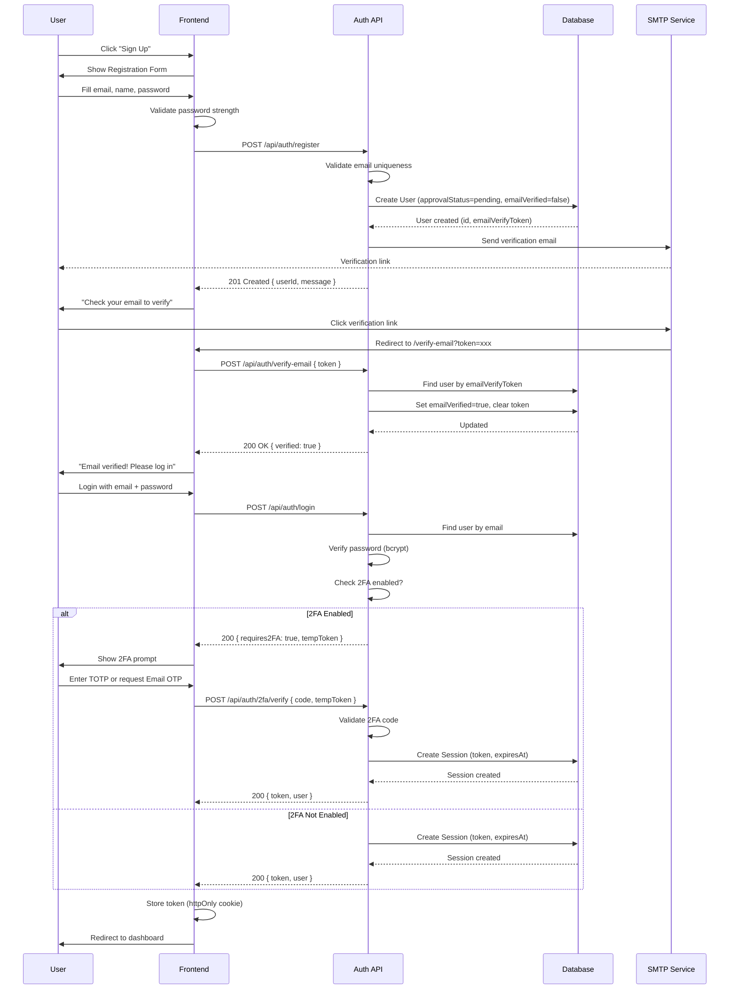

## 1.2 Detailed Step Descriptions

### Step 1: Registration Form Submission
The user navigates to the registration page and provides their email address, full name, and password. The frontend validates the password meets minimum requirements (8+ characters, uppercase, lowercase, number, special character) before submitting. A `POST /api/auth/register` request is sent with the form data.

**API Validation Rules:**
- Email must be a valid format and not already registered
- Name must be at least 2 characters
- Password must pass the strength validator (`password-validator.ts`)
- No HTML or script injection in input fields

**Database Changes:**
- New `User` record created with: `email`, `name`, `password` (bcrypt hashed), `role = "user"`, `approvalStatus = "pending"`, `emailVerified = false`, `twoFactorEnabled = false`
- `emailVerifyToken` and `emailVerifyExpiry` set for email verification

**Error Handling:**
- **400** — Missing required fields or validation failure
- **409** — Email already registered → suggest "Forgot Password"
- **429** — Rate limited (max 5 registrations per IP per hour)
- **500** — Server error → generic error message shown

### Step 2: Email Verification
The system sends a verification email containing a unique token link. The token expires after 24 hours. When the user clicks the link, the frontend sends `POST /api/auth/verify-email` with the token.

**Database Changes:**
- `User.emailVerified = true`
- `User.emailVerifyToken = null`
- `User.emailVerifyExpiry = null`

**Error Handling:**
- **Token expired** → Show "Link expired" message with "Resend Verification" button
- **Token invalid** → Show error, suggest re-registering or contacting support
- **Already verified** → Redirect directly to login

### Step 3: Account Approval
After email verification, the account still has `approvalStatus = "pending"`. An admin must review and approve the account before the user can fully access the platform. If auto-approval is configured, the system sets `approvalStatus = "approved"` immediately after email verification.

**Database Changes:**
- `User.approvalStatus = "approved"` (or "rejected")
- `User.isActive = true`
- `AuditLog` entry created: `action = "approval_change"`, `entity = "user"`

### Step 4: Login
The user submits credentials via `POST /api/auth/login`. The server verifies the email exists, the password matches (bcrypt comparison), and the account is active and approved.

**Database Changes:**
- `User.lastLoginAt` updated to current timestamp
- `User.lastLoginIp` set to request IP
- `User.lastLoginDevice` set to parsed user agent
- New `Session` record created with: `token` (JWT), `userId`, `ipAddress`, `userAgent`, `expiresAt` (7 days), `lastActivity` (current time)

**Error Handling:**
- **401** — Invalid credentials (generic message to prevent enumeration)
- **403** — Account not approved or suspended
- **429** — Rate limited (max 10 login attempts per 15 minutes per IP)
- If 5 consecutive failures → temporary 30-minute lockout

### Step 5: Session Management
After successful login, the session token is stored in an httpOnly cookie. The frontend includes this token in the `Authorization: Bearer` header for all subsequent API requests.

**Session Lifecycle:**
- Token expires after 7 days
- `lastActivity` is updated on each API request
- Session can be refreshed via `POST /api/auth/refresh` (extends expiry by 7 days)
- User can logout via `POST /api/auth/logout` (deletes session from DB)
- Admin can terminate all sessions for a user (bulk session cleanup)

**Database Interactions:**
- Every API request: `Session` looked up by token, `lastActivity` updated
- Token refresh: `Session.expiresAt` extended
- Logout: `Session` record deleted

---

# 2. Product Discovery & Purchase Flow

## 2.1 Mermaid Flowchart

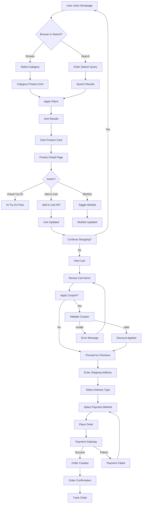

## 2.2 Detailed Step Descriptions

### Step 1: Product Browsing
The user lands on the homepage and can browse via category tiles or the product grid. The frontend fetches products via `GET /api/products` with optional query parameters for category, search, filters, sorting, and pagination.

**API Calls:**
- `GET /api/products?category=jewelry&page=1&limit=20` — Category browse
- `GET /api/search?q=ruby+necklace&category=jewelry&minPrice=1000&maxPrice=10000` — Search with filters

**Database Queries:**
- `Product.findMany()` with `where` clause for category, price range, stock status
- `Category.findMany()` for category listing
- Results include `category` relation for category badges

### Step 2: Product Detail
Clicking a product card navigates to the product detail page. The frontend fetches full product data via `GET /api/products/{id}`.

**API Call:**
- `GET /api/products/{id}` — Returns product with category, variants, images, reviews

**Database Queries:**
- `Product.findUnique()` with includes for `category`, `variants`, `productImages`, `reviews`
- `Review.findMany()` for product reviews (verified only, sorted by date)

### Step 3: Adding to Cart
The user clicks "Add to Cart" which calls `POST /api/cart` with productId, quantity, and optional variantId.

**API Call:**
- `POST /api/cart` — `{ productId, quantity, variantId, giftWrapping, greetingMessage, hidePrice }`

**Database Changes:**
- If no cart exists: `Cart.create()` with `sessionId` (and `userId` if authenticated)
- `CartItem.create()` with productId, quantity, variantId, gift options
- If item already exists: `CartItem.quantity` is incremented

**Error Handling:**
- **404** — Product not found
- **400** — Out of stock (stock < requested quantity)
- **400** — Invalid variant ID

### Step 4: Checkout Process
The user proceeds to checkout from the cart. The checkout estimate is fetched first via `POST /api/checkout/estimate`.

**API Call:**
- `POST /api/checkout/estimate` — Returns subtotal, shipping, tax, discount for the cart

**Shipping Calculation:**
- Based on delivery address (city, state, country)
- Delivery type: standard (free over INR 999), express (INR 199), same-day (INR 499)

**Tax Calculation:**
- GST applied based on product category and delivery state
- Integrated GST (IGST) for inter-state, CGST+SGST for intra-state

### Step 5: Payment Processing
The user places the order, which creates a payment session via `POST /api/payments/create-session`.

**API Calls:**
- `POST /api/payments/create-session` — Creates Razorpay order or Stripe checkout session
- `POST /api/payments/verify` — Verifies payment after gateway callback

**Database Changes:**
- `Order.create()` with all customer details, items, and status
- `OrderItem.create()` for each cart item
- `PaymentSession.create()` with provider details
- Cart items are removed after order creation
- For each product: `Product.stock` decremented, `InventoryLog` created (type: "out")

**Error Handling:**
- **Payment failed** → User can retry with same or different method
- **Payment timeout** → Order created with `paymentStatus = "pending"`, user can retry payment
- **Stock changed** → If stock depleted during checkout, user is notified and item removed

### Step 6: Order Tracking
After successful payment, the user can track the order via `GET /api/orders/{id}/tracking`.

**API Call:**
- `GET /api/orders/{id}/tracking` — Returns tracking events and current status

**Database Queries:**
- `Order.findUnique()` with includes for `trackingEvents`, `items`
- `OrderTrackingEvent.findMany()` sorted by timestamp

---

# 3. AI Virtual Try-On Flow

## 3.1 Mermaid Sequence Diagram

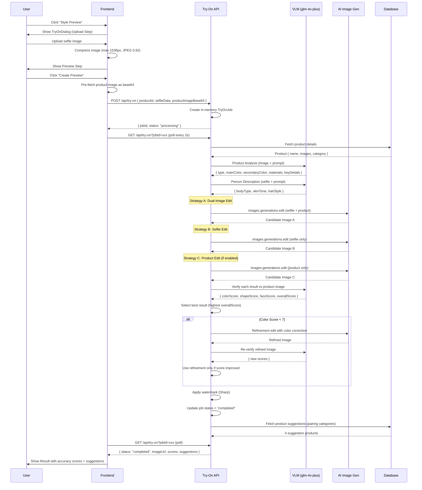

## 3.2 Detailed Step Descriptions

### Step 1: Selfie Upload and Compression
The user uploads a selfie through the TryOnDialog. The frontend immediately compresses the image using HTML Canvas API: resizing to max 1536px on the longest side and encoding as JPEG at quality 0.92.

**Validation Rules:**
- File type: `image/jpeg`, `image/png`, `image/webp` only
- Max file size: 10MB before compression
- After compression: typically 200-400KB

**No Database Changes** at this step — processing is entirely client-side.

### Step 2: Job Creation
The frontend sends the compressed selfie (as base64 data URL) along with product details to `POST /api/try-on`. The server creates an in-memory `TryOnJob` object with a unique jobId, status "processing", and timestamps.

**API Request Body:**
```json
{
  "productId": "clx123",
  "selfieData": "data:image/jpeg;base64,...",
  "productImageBase64": "data:image/jpeg;base64,...",
  "productName": "Ruby Emerald Necklace Set",
  "categorySlug": "jewelry"
}
```

**In-Memory State:**
- `TryOnJob` created in `Map<string, TryOnJob>` (not persisted to database)

**Error Handling:**
- **400** — Missing required fields (productId, selfieData)
- **404** — Product not found
- **503** — AI service unavailable → return `mode: "canvas"` for client-side fallback

### Step 3: Product Analysis (VLM)
Two VLM calls run in parallel:

1. **Product Analysis**: Sends product image to `glm-4v-plus` with a prompt to extract visual properties (type, colors, materials, key details). Returns structured output like `TYPE: diamond bib necklace, MAIN_COLOR: deep maroon red #8B1A1A`.

2. **Person Description**: Sends user selfie to VLM to describe appearance (body type, skin tone, hair style). Used in prompt construction for single-image strategies.

**API Calls:**
- `zai.chat.compressions.create()` with VLM model and image attachment (×2 parallel calls)
- 1.2-second delay enforced between consecutive AI API calls

### Step 4: Multi-Strategy Generation
The pipeline attempts up to 4 generation strategies in priority order:

**Strategy A (Dual-Image Edit)**: Always attempted. Passes both selfie and product image to the AI model. Best for color accuracy (7-9/10 typical).

**Strategy B (Selfie Edit)**: Always attempted. Passes only selfie, describes product in text. Best for face preservation (9-10/10 typical).

**Strategy C (Product Edit)**: Only for categories with `useProductEdit: true`. Passes only product image, describes person in text. Best for product color fidelity but poor face match.

**Strategy D (Text-to-Image)**: Only if all edit strategies failed. Generates from text alone. Lowest quality (face won't match, colors approximate).

**API Calls per strategy:**
- `zai.images.generations.edit()` for A, B, C
- `zai.images.generations.create()` for D
- 1.2-second delay between each strategy attempt

### Step 5: VLM Verification and Selection
Each generated image is compared against the original product image using the VLM. The VLM scores each result on Color (0-10), Shape (0-10), Face (0-10), and Overall (0-10).

**Selection Logic:**
1. Track the result with the highest `overallScore`
2. Early stop: If any result has `colorScore >= 8` AND passes verification, skip remaining checks
3. Weights: Color (0.35), Product Fidelity (0.25), Placement (0.20), Face (0.10), Overall (0.10)

**Database Changes:**
- None — scores are stored in the in-memory job object

### Step 6: Refinement (Conditional)
Triggered only if the best result's `colorScore < 7`. The VLM's `ISSUE` field provides specific color mismatch details which are used to build a correction prompt. The best result is re-edited with the correction prompt and re-verified. The refinement is used only if it scores higher than the original.

**Maximum iterations:** 1 (prevents infinite refinement loops)

### Step 7: Watermarking and Delivery
The final image is watermarked server-side using the `sharp` library:
- "3BOXES GIFTS" text + "AI Style Preview" subtitle
- Positioned at bottom-right with padding
- Logo at 60% opacity, text at 85% opacity
- Golden amber gradient colors (#B8860B → #DAA520)

The watermarked image is encoded as base64 PNG and stored in the job's `imageUrl`.

**Job Cleanup:** A background `setInterval` runs every 5 minutes and deletes jobs older than 15 minutes.

---

# 4. Social Style Integration Flow

## 4.1 Mermaid Flowchart

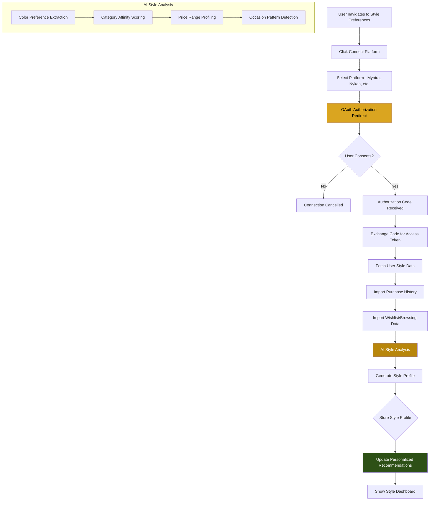

## 4.2 Detailed Step Descriptions

### Step 1: Platform Connection
The user navigates to Profile > Style Preferences > Social Style and initiates a connection to an external platform. The system redirects the user to the platform's OAuth authorization page.

**API Calls:**
- `GET /api/integrations/discover` — List available platform integrations
- `GET /api/integrations/{id}` — Get integration details and auth URL

**Database Queries:**
- `PlatformIntegration.findMany()` — List active integrations
- `PlatformIntegration.findUnique()` — Get specific integration details

### Step 2: User Consent
The user reviews the data access permissions and grants or denies consent. If consent is denied, the flow ends with no data stored. If consent is granted, the platform returns an authorization code.

**Consent Scope:**
- Read purchase history (products, categories, prices)
- Read wishlist and browsing patterns
- Read style preferences (if available)
- Does NOT include: payment details, personal address, phone number

**Database Changes:**
- `PlatformIntegration.lastSyncedAt` updated
- `PlatformIntegration.syncStatus` set to "syncing"

### Step 3: Data Import
The system exchanges the authorization code for an access token and fetches the user's style data from the platform.

**API Calls:**
- `POST /api/integrations/sync` — Trigger data sync for the integration
- Platform-specific API calls to fetch purchase history, wishlists, etc.

**Database Changes:**
- `SyncLog.create()` with type "incremental", status "started"
- `SyncLog` updated with `productsFound`, `productsAdded`, `productsUpdated`
- `SyncLog.status` set to "completed" or "failed"

**Error Handling:**
- **Token expired** → Re-authenticate user
- **API rate limited** → Schedule retry after cooldown period
- **Data parsing error** → Log error, continue with partial data

### Step 4: AI Style Analysis
The imported data is analyzed by the AI to generate a style profile:

1. **Color Preference Extraction**: Analyzes purchased/wishlisted product colors to identify preferred color palettes (warm, cool, neutral, vibrant)
2. **Category Affinity Scoring**: Calculates affinity scores for each product category based on browsing and purchase patterns
3. **Price Range Profiling**: Identifies typical spending ranges per category
4. **Occasion Pattern Detection**: Recognizes gifting occasions from purchase timing and patterns

**AI Processing:**
- Uses `glm-4v-plus` VLM to analyze product images from purchase history
- Generates structured style profile with scores and preferences

### Step 5: Style Profile and Recommendations
The generated style profile is used to personalize the user's experience:

- Homepage product recommendations are re-ranked based on style preferences
- Category pages show "Recommended for You" sections
- Product detail pages show "Matches Your Style" badges
- Gift Builder and Family Shopping use style data for smarter suggestions

**Database Changes:**
- Style profile stored as user metadata (JSON in User record or separate profile table)
- `PlatformIntegration.syncStatus` set to "idle"
- `PlatformIntegration.lastSyncedAt` updated to current time

---

# 5. 3Box Curate Flow

## 5.1 Mermaid Flowchart

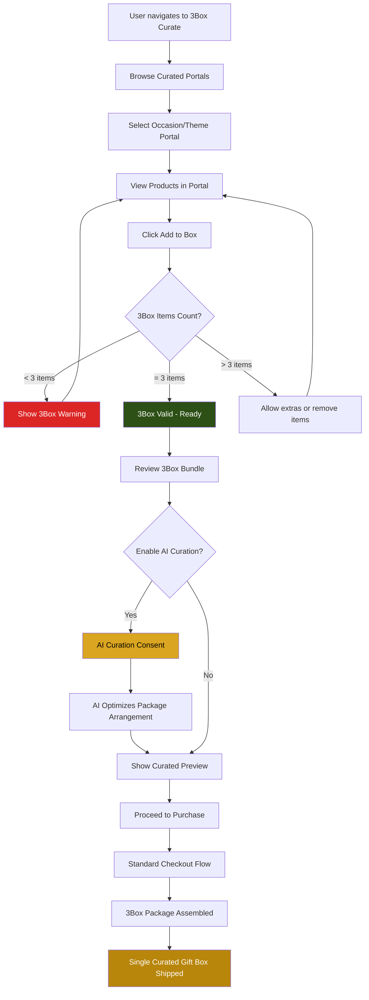

## 5.2 Detailed Step Descriptions

### Step 1: Portal Browsing
The 3Box Curate feature presents themed portals organized by occasion (Wedding, Diwali, Birthday, Anniversary) and style (Luxury, Traditional, Modern). Each portal contains a curated selection of products from multiple categories designed to complement each other.

**API Calls:**
- `GET /api/categories` — Fetch portal categories with sub-portals
- `GET /api/products?portal=3box-wedding` — Fetch products within a portal

**Database Queries:**
- `Category.findMany()` with portal-related filters
- `Product.findMany()` with occasion and category filters

### Step 2: Adding Items to Bundle
The user adds products to their 3Box bundle. The system enforces a minimum of 3 items (the "3Box" concept). The frontend tracks the bundle in local state and validates the count.

**Validation Rules:**
- Minimum 3 items to form a valid 3Box
- Maximum 7 items per bundle (practical limit)
- Items must be in stock
- One item per product (quantities are set to 1)

**No Database Changes** at this step — the bundle is managed in client-side state (Zustand store).

### Step 3: AI Curation Consent
When the user has a valid 3Box (3+ items), they can opt into AI Curation. This allows the AI to:
- Suggest optimal product arrangement within the gift box
- Recommend substitutions for better thematic coherence
- Optimize color coordination across the selected items

**Consent Required:** The user must explicitly consent to AI processing their selections. A consent dialog explains what data is used and what the AI does.

**Database Changes:**
- If user shares the try-on result to gallery: `CustomerPortfolio.create()` with `consentGiven = true`

### Step 4: Purchase and Assembly
After review, the user proceeds through the standard checkout flow. The 3Box bundle is treated as a single order with special handling:

- All items are packaged together in a single luxury gift box
- Custom 3Box packaging with branded tissue paper and arrangement card
- Single shipping charge for the entire box
- Combined invoice with itemized breakdown

**Database Changes:**
- `Order.create()` with all 3Box items as `OrderItem` records
- `Order.giftWrapping = true` (mandatory for 3Box)
- `Order.giftWrapStyle = "3box-curated"`
- Inventory decremented for each product

---

# 6. Family Shopping Flow

## 6.1 Mermaid Flowchart

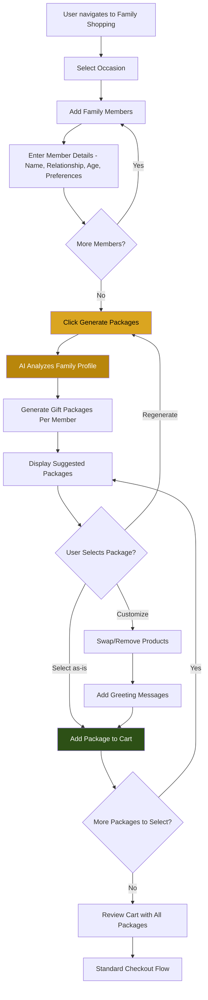

## 6.2 Detailed Step Descriptions

### Step 1: Occasion Selection
The user selects the occasion for which they are shopping (Diwali, Birthday, Anniversary, Wedding, Festival, Housewarming, etc.). This determines the product categories and themes for AI-generated suggestions.

**API Call:**
- `GET /api/family/packages?occasion=diwali` — Fetch available package templates

### Step 2: Adding Family Members
The user enters details for each family member:
- **Name** (required)
- **Relationship** (spouse, parent, child, sibling, friend)
- **Age Range** (child 0-12, teen 13-17, adult 18-59, senior 60+)
- **Preferences** (optional: preferred colors, styles, categories)

**Validation:**
- At least 1 family member required
- Age range affects product category filtering (kids → toys, adults → jewelry/watches)

### Step 3: AI Package Generation
The AI analyzes the family profile and generates personalized gift packages:

1. Each family member is matched with suitable product categories based on relationship, age, and occasion
2. Products are selected from the catalog with high ratings and appropriate price ranges
3. Each package includes 1-3 product suggestions with a match score (percentage)
4. The AI considers budget constraints and occasion appropriateness

**API Call:**
- `POST /api/family/packages` — `{ occasion, members: [{ name, relationship, ageRange, preferences }] }`

**Response:**
```json
{
  "packages": [
    {
      "memberName": "Priya",
      "relationship": "spouse",
      "products": [
        { "id": "clx1", "name": "Gold Temple Necklace", "price": 4999, "matchScore": 95 }
      ],
      "totalPrice": 4999,
      "matchScore": 95
    }
  ]
}
```

### Step 4: Package Customization
The user can customize each suggested package:
- Swap individual products within a package
- Remove products
- Add greeting messages per package
- Toggle gift wrapping per package
- Adjust quantities

### Step 5: Cart and Checkout
Selected packages are added to the cart with proper gift wrapping and messages. Each family member's package is grouped in the cart with a "Gift for [Name]" label.

**Database Changes:**
- `CartItem.create()` for each product in each selected package
- `CartItem.giftWrapping = true`, `CartItem.greetingMessage` set per item
- Standard checkout flow follows

---

# 7. Gift Builder Flow

## 7.1 Mermaid Flowchart

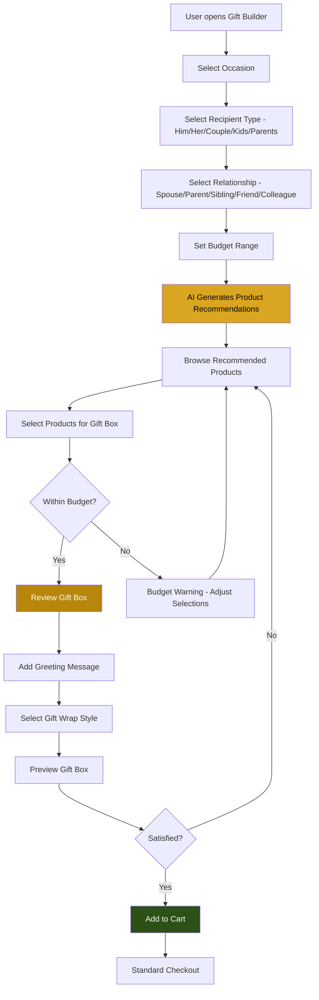

## 7.2 Detailed Step Descriptions

### Step 1: Occasion and Recipient Selection
The Gift Builder guides the user through a structured flow:
1. **Occasion**: Birthday, Anniversary, Wedding, Diwali, Christmas, Valentine's, Farewell, Congratulations
2. **Recipient Type**: Him, Her, Couple, Kids, Parents, Friend, Colleague
3. **Relationship**: Spouse, Parent, Sibling, Friend, Colleague, Boss
4. **Budget**: Slider or manual input (min INR 500, max INR 100,000)

**API Call:**
- `GET /api/products?occasion=birthday&recipient=her&relationship=spouse&minPrice=1000&maxPrice=5000`

**Database Queries:**
- `Product.findMany()` with `where` matching `occasions`, `recipientTypes`, `relationships`, and price range

### Step 2: AI-Powered Recommendations
The AI processes the user's selections and generates ranked product recommendations:
1. Products matching the occasion, recipient, and relationship are filtered
2. Products within budget are prioritized
3. AI scoring considers: product rating, review count, occasion relevance, trend data
4. Top 10-15 products are presented with match percentages

**Smart Bundle Suggestions:**
- The AI suggests complementary products that pair well together
- Example: Necklace + Earrings + Bracelet for "Her" birthday
- Total bundle price stays within the specified budget

### Step 3: Gift Box Assembly
The user selects products to include in their gift box:
- Each product shows: image, name, price, match score
- Running total updates in real-time
- Budget bar shows remaining amount
- Gift wrapping options: Classic, Premium, Luxury
- Greeting message: custom text or template selection

### Step 4: Preview and Cart
The gift box preview shows:
- All selected products in a visual gift box layout
- Total price including gift wrapping
- Estimated delivery date
- Greeting card preview

**Database Changes:**
- `CartItem.create()` for each selected product
- `CartItem.giftWrapping = true`, `CartItem.greetingMessage` set
- Cart ready for standard checkout

---

# 8. Corporate Gifting Flow

## 8.1 Mermaid Sequence Diagram

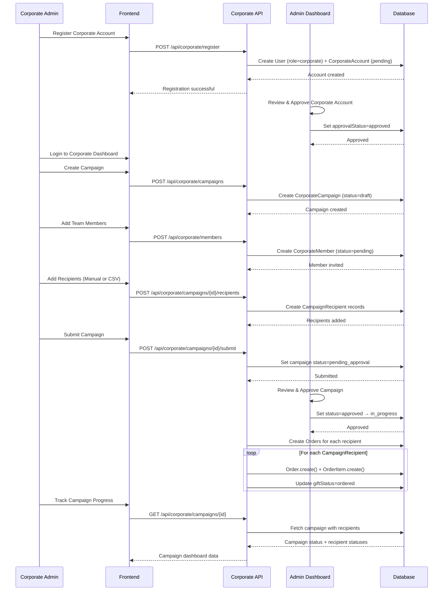

## 8.2 Detailed Step Descriptions

### Step 1: Corporate Registration
The corporate admin registers via the dedicated corporate registration form. This creates both a `User` record and a `CorporateAccount` record with `approvalStatus = "pending"`.

**API Call:**
- `POST /api/corporate/register` — `{ companyName, industry, website, gstNumber, panNumber, contactName, contactEmail, contactPhone, billingAddress }`

**Database Changes:**
- `User.create()` with `role = "corporate"`, `corporateRole = "corporate_admin"`
- `CorporateAccount.create()` with company details and `approvalStatus = "pending"`
- Admin reviews in the admin dashboard and approves/rejects

### Step 2: Campaign Creation
After account approval, the corporate admin creates a gifting campaign.

**API Calls:**
- `POST /api/corporate/campaigns` — Create new campaign (status: "draft")
- `GET /api/products` — Browse products for campaign selection
- `PUT /api/corporate/campaigns/{id}` — Update campaign details

**Database Changes:**
- `CorporateCampaign.create()` with name, occasion, budget, delivery details
- `CorporateCampaign.productId` set to selected product

### Step 3: Team Member Management
Corporate admin invites team members to help manage campaigns.

**API Calls:**
- `POST /api/corporate/members` — Invite team member
- `PUT /api/corporate/members/{memberId}` — Update role or status
- `DELETE /api/corporate/members/{memberId}` — Remove member

**Database Changes:**
- `CorporateMember.create()` with email, role, `status = "pending"`
- When member accepts: `CorporateMember.status = "active"`, `userId` linked, `joinedAt` set

### Step 4: Recipient Management
Campaign recipients can be added manually or via CSV import.

**API Calls:**
- `POST /api/corporate/campaigns/{id}/recipients` — Add single recipient
- `POST /api/corporate/recipients/import-csv` — Bulk import via CSV
- `PUT /api/corporate/campaigns/{id}/recipients/{recipientId}` — Update recipient
- `DELETE /api/corporate/campaigns/{id}/recipients/{recipientId}` — Remove recipient

**CSV Import Validation:**
- Required: name, email, address, city, state, zipCode
- Optional: phone, designation, department, productId, budget, message
- Duplicates detected by email within the same campaign
- Invalid rows are skipped with error details in response

**Database Changes:**
- `CampaignRecipient.create()` for each valid recipient
- `giftStatus = "pending"` for all new recipients

### Step 5: Branding Customization
The corporate admin configures branding settings that apply to all gifts in their campaigns.

**API Calls:**
- `GET /api/corporate/branding` — Get current branding settings
- `PUT /api/corporate/branding` — Update branding settings

**Database Changes:**
- `CorporateBranding.upsert()` with logo, colors, packaging, messaging preferences
- Settings include: `hidePrice` (default true), `includeBranding` (default true), `packagingType`, `giftWrapStyle`

### Step 6: Campaign Submission and Approval
The corporate admin submits the campaign for processing. An admin reviews and approves.

**API Call:**
- `POST /api/corporate/campaigns/{id}/submit` — Submit for approval

**Database Changes:**
- `CorporateCampaign.status` changes: `draft` → `pending_approval`
- Admin approves: `pending_approval` → `approved` → `in_progress`
- For each recipient: `Order.create()` + `OrderItem.create()`
- `CampaignRecipient.giftStatus` updated to `"ordered"`
- `CampaignRecipient.orderId` linked to new order

### Step 7: Campaign Tracking
The corporate admin monitors the progress of their campaign through the dashboard.

**API Call:**
- `GET /api/corporate/campaigns/{id}` — Campaign details with recipient statuses
- `GET /api/corporate/campaigns` — List all campaigns with summary stats

**Dashboard Metrics:**
- Total recipients vs gifts delivered
- Budget utilized vs allocated
- Recipient status breakdown (pending, ordered, shipped, delivered)
- Average delivery time

---

# 9. Training Content Management Flow

## 9.1 Mermaid Flowchart

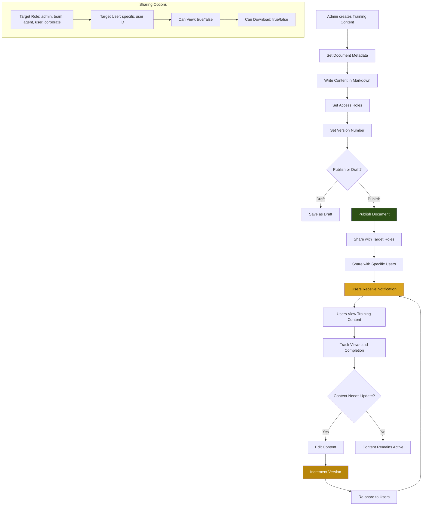

## 9.2 Detailed Step Descriptions

### Step 1: Content Creation
An admin or team member creates training content through the wiki document editor. Training content is stored as `WikiDocument` records with `docType = "training"`.

**API Call:**
- `POST /api/wiki` — Create new wiki document

**Request Body:**
```json
{
  "title": "AI Virtual Try-On Agent Training v2.0",
  "slug": "ai-tryon-agent-training-v2",
  "content": "# AI Virtual Try-On Training\n\n...",
  "category": "training",
  "docType": "training",
  "accessRoles": "admin,team,agent",
  "version": "2.0",
  "isPublished": true
}
```

**Database Changes:**
- `WikiDocument.create()` with all metadata fields
- `createdBy` set to the admin's user ID

### Step 2: Access Role Configuration
The admin configures which roles can access the training content:
- `accessRoles` on the `WikiDocument` — determines who can see it in the wiki listing
- `TrainingShare` records — finer-grained control for specific roles and users

**Database Changes:**
- `WikiDocument.accessRoles` set (e.g., "admin,team,agent")
- `TrainingShare.create()` for each share: docId, targetRole, targetUserId, canView, canDownload

### Step 3: Content Sharing
Training content is shared via two mechanisms:

**Role-Based Sharing:**
- Set `targetRole` to share with all users of a specific role
- Example: Share "Agent Training Guide" with `targetRole = "agent"`

**User-Specific Sharing:**
- Set `targetUserId` to share with a specific user
- Example: Share "Advanced Troubleshooting" with a specific support agent

**API Call:**
- `POST /api/admin/share-doc` — Share document with agents
- Training shares created via wiki API

**Database Changes:**
- `AgentDocShare.create()` — Share with specific agents
- `TrainingShare.create()` — Share with roles or specific users

### Step 4: View Tracking
When users access training content, the system tracks:
- Number of views per document
- Last viewed timestamp per user
- Completion status (if the document has acknowledgment requirements)

**API Call:**
- `GET /api/wiki/{id}` — Fetch document (increments view count)

### Step 5: Version Updates
When training content needs updating, the admin edits the document and increments the version number.

**Version Convention:**
- Minor updates (typos, formatting): increment decimal (1.0 → 1.1)
- Major updates (new sections, restructured content): increment major (1.1 → 2.0)

**Database Changes:**
- `WikiDocument.version` updated
- `WikiDocument.updatedAt` auto-updated
- `WikiDocument.content` replaced with new content
- Re-sharing is needed if the target audience has changed

---

# 10. Order Fulfillment Flow

## 10.1 Mermaid Flowchart

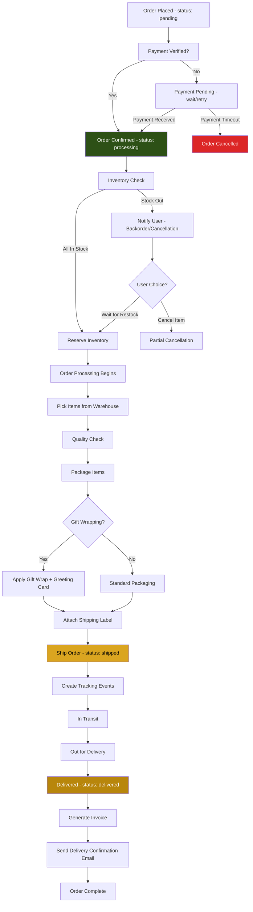

## 10.2 Detailed Step Descriptions

### Step 1: Order Created
When a customer places an order, the system creates an `Order` record with `status = "pending"` and `paymentStatus = "pending"`.

**Database Changes:**
- `Order.create()` with customer details, items, totals
- `OrderItem.create()` for each item in the cart
- `PaymentSession.create()` with payment provider details
- Cart items removed after order creation

### Step 2: Payment Verification
The payment gateway (Razorpay/Stripe) processes the payment and sends a callback.

**API Call:**
- `POST /api/payments/verify` — Verify payment after gateway callback

**Database Changes:**
- `PaymentSession.status` updated to "paid"
- `PaymentSession.paymentId` set to provider payment ID
- `PaymentSession.method` set (card, upi, netbanking, wallet)
- `Order.paymentStatus` updated to "paid"

**Error Handling:**
- Payment failed: `Order.paymentStatus = "failed"`, user can retry
- Payment timeout: Order remains in "pending" for 30 minutes, then auto-cancelled

### Step 3: Inventory Check and Reservation
After payment confirmation, the system verifies stock availability for all order items.

**Database Changes:**
- `Product.stock` decremented for each item
- `InventoryLog.create()` with type "out", quantity, note "Order #{orderNumber}"
- If stock is insufficient: `Product.stockStatus = "out_of_stock"`, user notified

**Error Handling:**
- Partial stock: Some items available, others not → offer partial shipment or cancellation
- Complete stock out: Full order cancellation with immediate refund

### Step 4: Order Processing
The order moves to "processing" status. Warehouse staff picks items, performs quality checks, and packages them.

**Database Changes:**
- `Order.status = "processing"`
- `OrderTrackingEvent.create()` with status "confirmed" and "processing"

### Step 5: Packaging and Gift Wrapping
If gift wrapping is selected (per item):
- Classic wrap: Standard gift paper + ribbon
- Premium wrap: Luxury box + satin ribbon + branded card
- 3Box Curated wrap: Custom 3Box luxury box with arrangement card

For corporate orders, `CorporateBranding` settings are applied:
- `includeBranding = true` → Corporate logo on packaging
- `hidePrice = true` → No price shown on packing slip
- `cardTemplate` → Custom greeting card with company branding

### Step 6: Shipping
The order is shipped with a tracking number.

**Database Changes:**
- `Order.status = "shipped"`
- `Order.trackingNumber` set
- `Order.trackingUrl` set
- `Order.estimatedDelivery` set based on delivery type
- `OrderTrackingEvent.create()` with status "shipped", location, description

### Step 7: Delivery and Invoice
When the order is delivered, the system generates an invoice and sends confirmation.

**Database Changes:**
- `Order.status = "delivered"`
- `OrderTrackingEvent.create()` with status "delivered"
- `OrderInvoice.create()` with invoice number, amounts, status "generated"
- Invoice PDF generated and stored at `pdfUrl`
- Invoice sent to customer email

**API Calls:**
- `GET /api/orders/{id}/invoice` — Fetch invoice
- `GET /api/invoices/{id}` — Get invoice details

---

# 11. Return & Refund Flow

## 11.1 Mermaid Flowchart

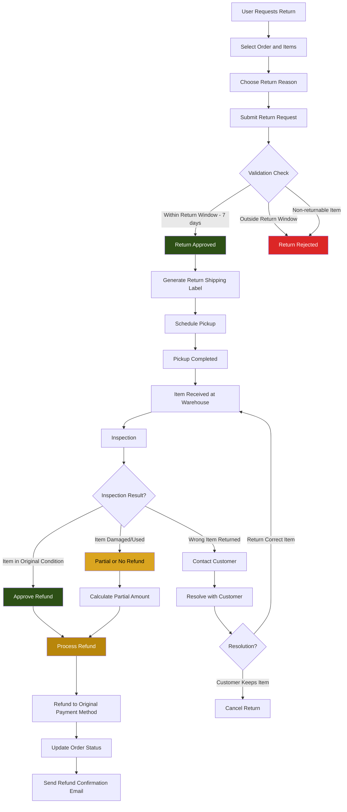

## 11.2 Detailed Step Descriptions

### Step 1: Return Request
The user initiates a return from the order detail page. They select the items to return and provide a reason.

**Return Reasons:**
- Product damaged/defective
- Wrong product received
- Product does not match description
- Changed mind / No longer needed
- Size/fit issue
- Other (with description)

**API Call:**
- `POST /api/orders/{id}/refund` — Submit refund request

**Request Body:**
```json
{
  "items": [{ "orderItemId": "clx1", "quantity": 1, "reason": "Product does not match description" }],
  "comment": "The color is different from what was shown",
  "images": ["data:image/jpeg;base64,..."]
}
```

### Step 2: Return Validation
The system validates the return request:

**Validation Rules:**
- Return must be within 7 days of delivery
- Item must be in the "delivered" order status
- Certain items may be non-returnable (customized products, fragrances once opened)
- Return photos may be required for damage claims

**Database Changes:**
- `Order.refundStatus = "pending"`
- `Order.cancelReason` set to return reason

**Error Handling:**
- **400** — Outside return window
- **400** — Non-returnable item
- **404** — Order not found or not delivered

### Step 3: Pickup Scheduling
Once approved, a pickup is scheduled with the logistics partner.

**Process:**
1. Return shipping label generated with tracking
2. Pickup scheduled for the customer's address
3. Customer receives pickup confirmation with date and time slot
4. Logistics partner picks up the package from the customer

**API Integration:**
- Logistics partner API for pickup scheduling
- Tracking number generated for return shipment

### Step 4: Inspection
The returned item is inspected at the warehouse:

**Inspection Criteria:**
- Item matches the original product (correct SKU, variant)
- Item is in original condition (unused, undamaged, with tags)
- All accessories and packaging included
- No signs of wear or alteration

**Inspection Outcomes:**
- **Pass**: Full refund approved
- **Partial pass**: Item shows minor signs of use → partial refund (e.g., 70%)
- **Fail**: Item is damaged, used, or wrong item → no refund, item returned to customer

### Step 5: Refund Processing
After inspection approval, the refund is processed to the original payment method.

**API Call:**
- `POST /api/orders/{id}/refund` — Process refund (admin action)

**Refund Methods:**
- **Original payment method**: Card refund, UPI refund (5-7 business days)
- **Store credit**: Instant, can be used for future purchases
- **Bank transfer**: For COD orders (7-10 business days)

**Database Changes:**
- `Order.refundStatus = "processed"`
- `Order.refundAmount` set to refund amount
- `Order.refundedAt` set to current timestamp
- `PaymentSession` updated with refund details
- `Product.stock` incremented (item returned to inventory)
- `InventoryLog.create()` with type "return", quantity, note "Return from Order #{orderNumber}"

**Error Handling:**
- Refund processing failure → Retry after 24 hours
- Bank rejection → Contact customer for alternative method
- Partial refund dispute → Escalate to finance manager

---

# 12. 2FA Authentication Flow

## 12.1 Mermaid Flowchart

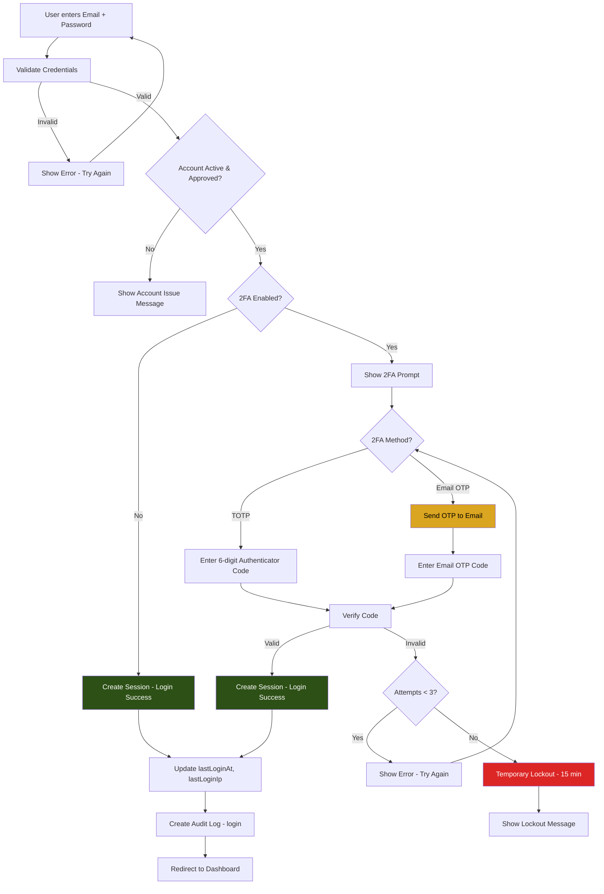

## 12.2 Detailed Step Descriptions

### Step 1: Credential Validation
The user submits their email and password. The server performs the following validations:

1. **Email lookup**: Find `User` record by email
2. **Password verification**: Compare bcrypt hash
3. **Account status check**: `isActive = true`, `approvalStatus = "approved"`
4. **Email verification check**: `emailVerified = true`

**API Call:**
- `POST /api/auth/login` — `{ email, password }`

**Response (2FA not enabled):**
```json
{ "token": "eyJhbG...", "user": { "id": "clx1", "email": "...", "role": "user" } }
```

**Response (2FA enabled):**
```json
{ "requires2FA": true, "tempToken": "temp_xxx", "methods": ["totp", "email_otp"] }
```

**Error Handling:**
- **401** — Invalid credentials (generic message)
- **403** — Account not approved or suspended
- **403** — Email not verified → suggest resending verification

### Step 2: TOTP Verification
If the user has TOTP (authenticator app) enabled:

1. User opens their authenticator app (Google Authenticator, Authy, etc.)
2. The app generates a 6-digit code based on the shared secret and current time
3. The code changes every 30 seconds (RFC 6238 TOTP standard)
4. User enters the current code in the verification field
5. Server validates the code against the stored `twoFactorSecret`

**API Call:**
- `POST /api/auth/2fa/verify` — `{ code: "123456", tempToken: "temp_xxx" }`

**Server-Side Validation:**
- Generate expected TOTP code from `User.twoFactorSecret` + current time
- Allow ±1 time window (30 seconds each direction) for clock drift
- If code matches: authentication successful

**Database Changes:**
- `Session.create()` with token, userId, device info, expiry
- `AuditLog.create()` with `action = "login"`, `details = "{\"method\": \"2fa_totp\"}"`

### Step 3: Email OTP Verification
If the user chooses or is configured for email OTP:

1. User clicks "Send Code" on the 2FA prompt
2. System generates a random 6-digit OTP
3. OTP is stored: `User.otpCode = hash(otp)`, `User.otpExpiry = now + 5 minutes`
4. OTP is sent to the user's registered email via SMTP
5. User enters the received code

**API Call:**
- `POST /api/auth/2fa/email-otp` — `{ tempToken: "temp_xxx" }` (sends OTP)
- `POST /api/auth/2fa/verify` — `{ code: "654321", tempToken: "temp_xxx" }` (verifies OTP)

**OTP Validation:**
- Compare submitted code against stored `otpCode`
- Check `otpExpiry` has not passed
- OTP is single-use: cleared after successful verification

**Database Changes:**
- `User.otpCode` and `User.otpExpiry` set when OTP is generated
- `User.otpCode` cleared after verification (set to null)
- `Session.create()` upon successful verification
- `AuditLog.create()` with `action = "login"`, `details = "{\"method\": \"2fa_email_otp\"}"`

**Error Handling:**
- **OTP expired** → "Code has expired. Please request a new one."
- **Invalid OTP** → "Invalid code. Please try again."
- **Email not received** → Check spam; "Resend Code" button (rate limited to 1 per minute)
- **Max OTP requests** → Limit 5 OTP requests per 30 minutes

### Step 4: Lockout Mechanism
After 3 consecutive failed 2FA verification attempts:

**Lockout Behavior:**
- Account is temporarily locked for 15 minutes
- All active sessions are terminated
- User sees: "Too many failed attempts. Please try again in 15 minutes."
- `AuditLog.create()` with `action = "lockout"`, `details = "{\"reason\": \"2fa_failures\"}"`

**Unlock:**
- Automatic: After 15 minutes, the lockout expires
- Manual: Admin can unlock the account via the admin dashboard
- The failed attempt counter resets after successful login or lockout expiry

### Step 5: 2FA Setup
Users can enable 2FA from their profile security settings.

**TOTP Setup Flow:**
1. `POST /api/auth/2fa/setup` — Generates a new TOTP secret and QR code URL
2. Response includes: `secret` (for manual entry), `qrCodeUrl` (for scanning)
3. User scans QR code with authenticator app
4. User enters the first generated code to verify setup
5. `POST /api/auth/2fa/verify` — Validates setup code
6. On success: `User.twoFactorEnabled = true`, `User.twoFactorSecret` stored
7. Backup codes are generated and shown to the user (one-time display)

**Database Changes:**
- `User.twoFactorSecret` set to the generated secret
- `User.twoFactorEnabled = true`
- `AuditLog.create()` with `action = "mfa_setup"`, `details = "{\"method\": \"totp\"}"`

**Admin-Enforced 2FA:**
- Admin can set `User.twoFactorRequired = true` for specific users or roles
- At next login, the user is forced to set up 2FA before accessing the platform
- This is common for admin and agent roles

---

## Document Revision History

| Version | Date | Author | Changes |
|---------|------|--------|---------|
| 1.0 | March 2026 | 3 BOXES Engineering & Operations Team | Initial workflow documentation with 12 Mermaid diagrams |

---

*For role-based Standard Operating Procedures, see [SOP-DOCUMENTS.md](./SOP-DOCUMENTS.md)*
